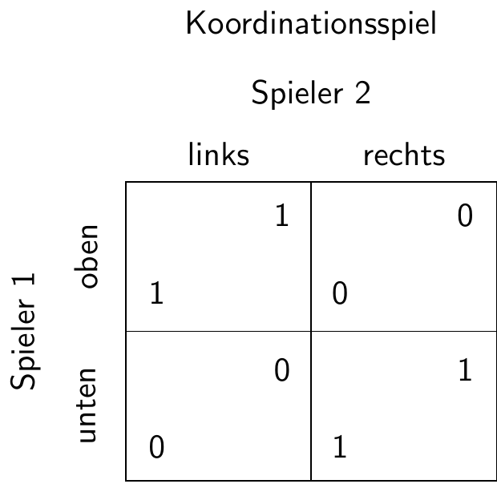
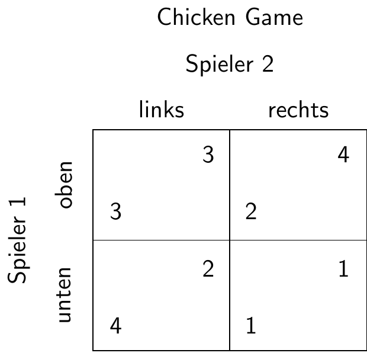
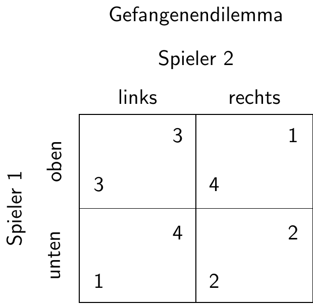
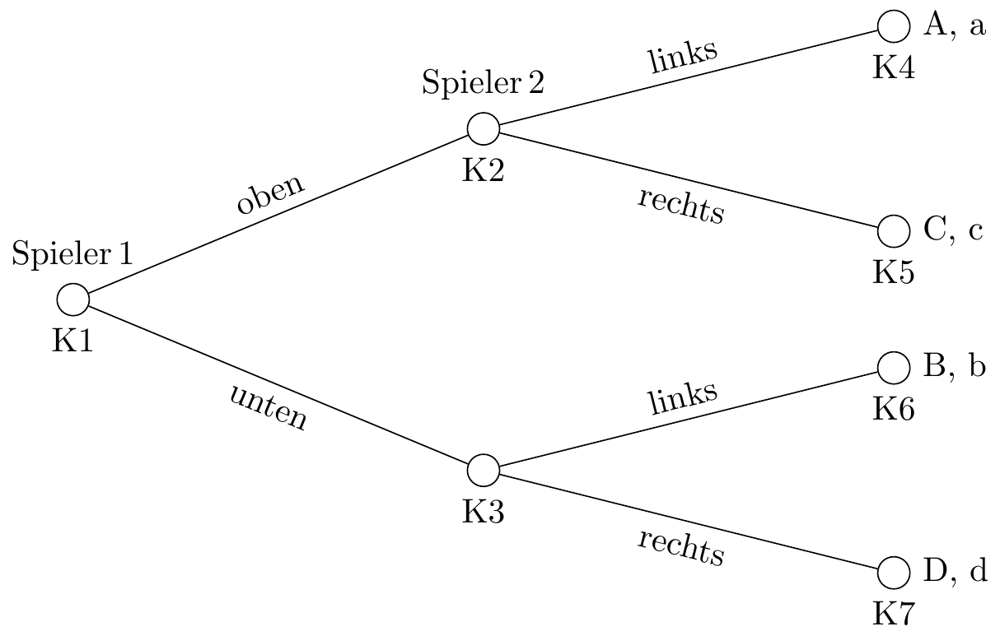
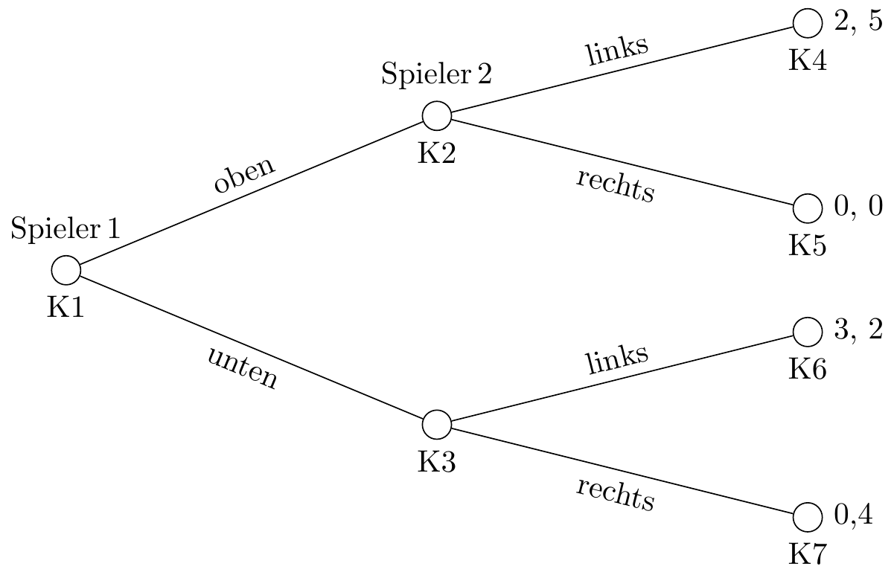
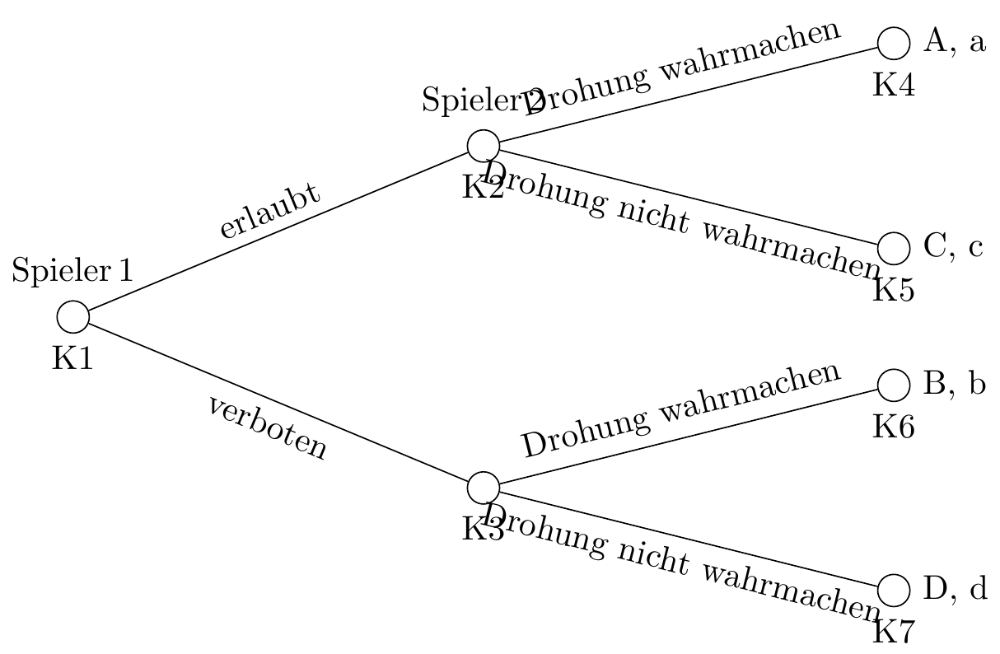
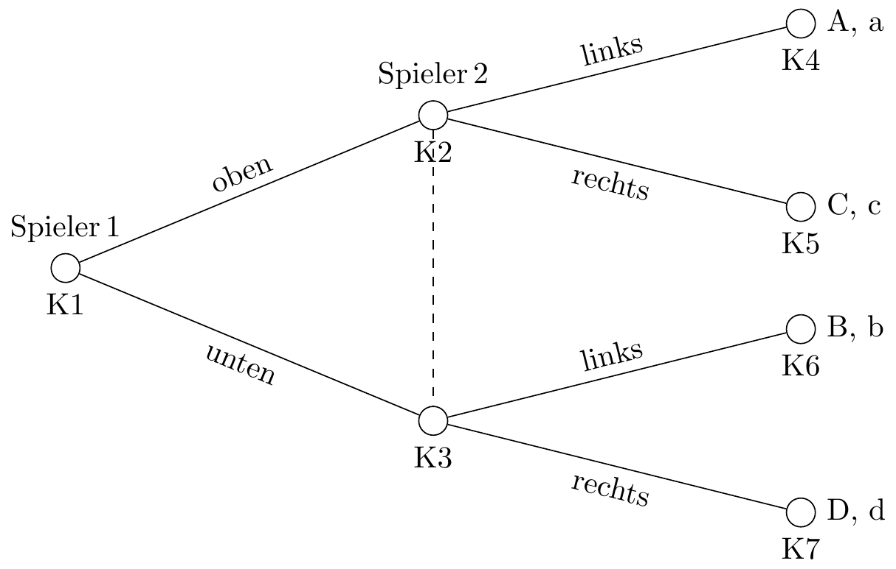
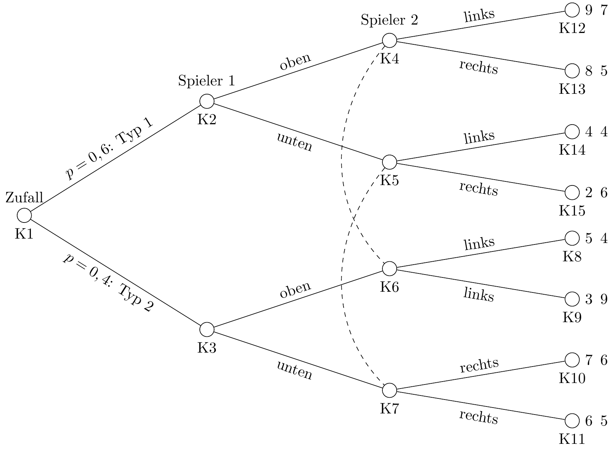
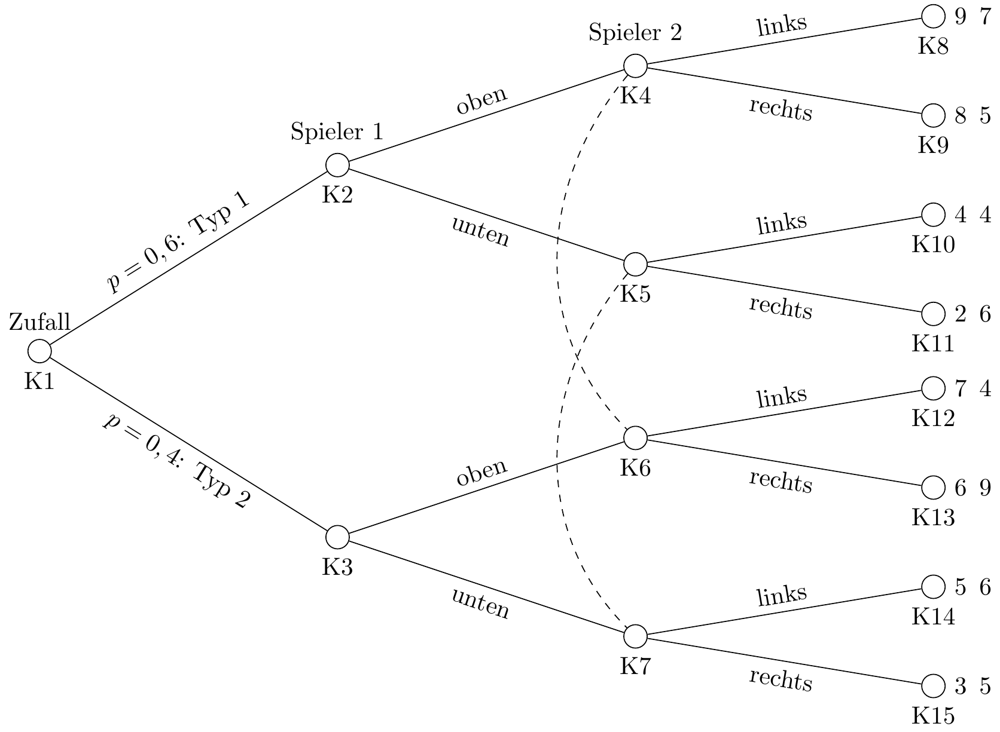
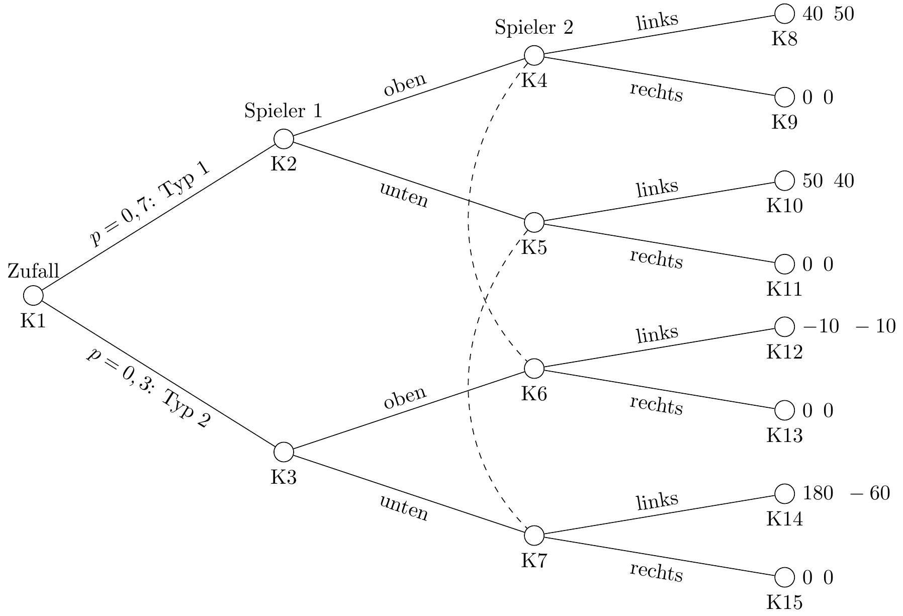

# Nicht-kooperative Spieltheorie

## Einleitung und begriffliche Einordnung

```{python}
#| message: false
#| warning: false
#| fig-cap: "Was macht (man mit) Spieltheorie?"

import graphviz
from IPython.display import display

def create_game_theory_workflow():
    dot = graphviz.Digraph('Spieltheorie_Workflow', comment='Wie Spieltheorie arbeitet')

    # Design: Flussdiagramm von oben nach unten
    dot.attr(rankdir='TB', size='10,12', fontname='Helvetica-Bold')
    dot.node_attr.update(style='filled', fontname='Helvetica', shape='box', margin='0.3')

    # SCHRITT 1: DIE MODELLIERUNG (Das "Wie")
    with dot.subgraph(name='cluster_modeling') as c:
        c.attr(label='1. REALITÄT ABSTRAHIEREN (Modellierung)', style='dashed', color='blue')
        c.node('INPUT', 'Komplexe Interaktion\n(Markt, Sport, Politik, Team, Natur, ...)', shape='ellipse', fillcolor='#E3F2FD')
        c.node('DEF', 'Definition des Rahmens:\n• Wer spielt mit? (Spieler)\n• Was können sie tun? (Strategien)\n• Was treibt sie an? (Auszahlungen)\n• Wie sind die Rahmenbedingungen? (Regeln)', fillcolor='#BBDEFB')

    # SCHRITT 2: DIE ANALYSE-MECHANIK (Das "Wie")
    with dot.subgraph(name='cluster_mechanics') as c:
        c.attr(label='2. MECHANIK DER SITUATION BESTIMMEN', style='dashed', color='green')
        c.node('TYPE', 'Klassifizierung:\n• Zeit: Gleichzeitig oder nacheinander?\n• Wissen: Wer weiß was wann?\n• Verträge: Sind Absprachen bindend?', fillcolor='#C8E6C9')

    # SCHRITT 3: DIE LÖSUNGSSUCHE (Das "Wie")
    with dot.subgraph(name='cluster_solution') as c:
        c.attr(label='3. GLEICHGEWICHT FINDEN (Die Berechnung)', style='dashed', color='orange')
        c.node('EQUIL', 'Suche nach Stabilität:\n"Welches Muster stellt sich ein?"\n(Nash-Gleichgewicht)', fillcolor='#FFE0B2', penwidth='2')

    # SCHRITT 4: DAS ERGEBNIS (Das "Was")
    with dot.subgraph(name='cluster_output') as c:
        c.attr(label='4. ERKENNTNISGEWINN (Das "Was")', style='dashed', color='purple')
        c.node('OUT', 'Anwendung & Vorhersage:\n• Wettbewerb\n• Auktionsdesigns\n• Tarifverträge\n• Kooperation in der Evolution\n• Strategische Beratung', fillcolor='#F3E5F5')

    # Den Prozess verbinden
    dot.edge('INPUT', 'DEF', label='Übersetzung in\nformale Sprache')
    dot.edge('DEF', 'TYPE', label='Strukturierung')
    dot.edge('TYPE', 'EQUIL', label='Mathematische\nAnalyse')
    dot.edge('EQUIL', 'OUT', label='Ableitung von\nHandlungen')

    return dot

# Visualisierung anzeigen
workflow_graph = create_game_theory_workflow()
display(workflow_graph)
```


```{python}
#| message: false
#| warning: false
#| fig-cap: "Zweige der Spieltheorie"

import graphviz
from IPython.display import display

def create_advanced_gt_workflow():
    dot = graphviz.Digraph('Spieltheorie_Methodik', comment='Detaillierter GT Workflow')

    # Design-Settings
    dot.attr(rankdir='LR', size='12,12', fontname='Helvetica')
    dot.node_attr.update(style='filled', fontname='Helvetica', shape='box', margin='0.2')

    # 1. INPUT: Die soziale Situation
    dot.node('START', 'Strategische Situation\n(Interdependenz)', shape='diamond', fillcolor='#AB82FF')

    # 2. DIE GABELUNG: Welches Paradigma wählen wir? (Das "Wie")

    # Zweig A: Nicht-Kooperativ 
    with dot.subgraph(name='cluster_noncoop') as c:
        c.attr(label='Nicht-kooperative Spieltheorie', color='#E53935', fontcolor='#E53935', style='dashed')
        c.node('NC_HOW', 'WIE: Fokus auf das Individuum.\nSuche nach stabilen Zuständen,\nwenn jeder nur an sich denkt.', fillcolor='#FFCDD2')
        c.node('NC_WHAT', 'WAS: Vorhersage von Konflikten,\nPreiskämpfen oder dem\nVersagen von Kooperation.', fillcolor='#FFEBEE')

    # Zweig C: Evolutionär 
    with dot.subgraph(name='cluster_evo') as c:
        c.attr(label='Evolutionäre Spieltheorie', color='#43A047', fontcolor='#43A047', style='dashed')
        c.node('E_HOW', 'WIE: Fokus auf Selektion.\nErfolgreiche Muster (Fitness)\nverdrängen schwache Muster.', fillcolor='#C8E6C9')
        c.node('E_WHAT', 'WAS: Verstehen von Traditionen,\nbiologischen Instinkten und\nlangfristigen Trends.', fillcolor='#E8F5E9')

    # Zweig B: Kooperativ 
    with dot.subgraph(name='cluster_coop') as c:
        c.attr(label='Kooperative Spieltheorie', color='#1E88E5', fontcolor='#1E88E5', style='dashed')
        c.node('C_HOW', 'WIE: Fokus auf die Gruppe.\nAnalyse von Koalitionen und\nbindenden Verträgen.', fillcolor='#BBDEFB')
        c.node('C_WHAT', 'WAS: Faire Aufteilung von\ngemeinsamen Gewinnen und\nstabile Allianzen.', fillcolor='#E3F2FD')

    # 3. LÖSUNG/OUTPUT
    dot.node('END', 'Ergebnis: Systemstabilität\n(Gleichgewicht)', shape='ellipse', fillcolor='#FFEB3B')

    # Verbindungen 
    dot.edge('START', 'NC_HOW', label='Individuelle\nEntscheidungen')
    dot.edge('NC_HOW', 'NC_WHAT')
    dot.edge('NC_WHAT', 'END')

    dot.edge('START', 'E_HOW', label='Lern- und\nSelektionsprozess')
    dot.edge('E_HOW', 'E_WHAT')
    dot.edge('E_WHAT', 'END')

    dot.edge('START', 'C_HOW', label='Verhandelbare\nVerträge')
    dot.edge('C_HOW', 'C_WHAT')
    dot.edge('C_WHAT', 'END')

    return dot

# Visualisierung anzeigen
advanced_gt_graph = create_advanced_gt_workflow()
display(advanced_gt_graph)

```


## Simultane Spiele

### Grundsätzliche Struktur eines Spiels


```{python}
#| message: false
#| warning: false

from lets_plot import *

LetsPlot.setup_html()

ggplot() + \
geom_text(x=- .5, y= 2   , label='a') +\
geom_text(x=-1.5, y=  .75, label='A') +\
geom_text(x=- .5, y=-1   , label='b') +\
geom_text(x=-1.5, y=-2.25, label='B') +\
geom_text(x= 1.5, y= 2   , label='c') +\
geom_text(x=  .5, y=  .75, label='C') +\
geom_text(x= 1.5, y=-1   , label='d') +\
geom_text(x=  .5, y=-2.25, label='D') +\
geom_text(x=-1  , y= 3.3 , label='links')+\
geom_text(x= 1  , y= 3.3 , label='rechts')+\
geom_text(x=-2.2, y= 1.375, angle=90, label='oben')+\
geom_text(x=-2.2, y=-1.625, angle=90, label='unten')+\
geom_text(x= 0 , y= 4 ,
          fontface = "bold", label='Spieler 2')+\
geom_text(x=-2.7 , y= 0 , angle=90,
          fontface = "bold", label='Spieler 1')+\
geom_segment(x=-2,  xend= 2, y= 0, yend= 0) +\
geom_segment(x=-2,  xend= 2, y= 3, yend= 3) +\
geom_segment(x=-2,  xend= 2, y=-3, yend=-3) +\
geom_segment(x=-2,  xend=-2, y=-3, yend= 3) +\
geom_segment(x= 0,  xend= 0, y=-3, yend= 3) +\
geom_segment(x= 2,  xend= 2, y=-3, yend= 3) +\
theme_void()+\
labs(title='Auszahlungen in einem simultanen Spiel' #,
    # caption = 'Caption'
)

```

### Reine Strategien

#### Definition Nash-Gleichgewicht

Ein Nash-Gleichgewicht liegt vor, wenn jeder Spieler die beste Antwort auf die beste Strategie des Gegenspielers spielt.

Formal:

$u_{i}\left(s_{i}^{*},s_{-i}^{*}\right)\geq u_{i}\left(s_{i},s_{-i}^{*}\right)\mbox{ für alle }i,\mbox{ }s_{i}\in S_{i}$

Intuition: Ein Nash-Gleichgewicht liegt vor, wenn kein Spieler mehr die Möglichkeit hat, seine Situation durch eine **nur eigene** Entscheidungsänderung zu verbessern.

In der Matrix oben heißt dass, das geprüft werden muss

$A \geq B \land a \geq c$ $\rightarrow$ **ol**

$B \geq A \land b \geq d$ $\rightarrow$ **ul**

$C \geq D \land c \geq a$ $\rightarrow$ **or**

$D \geq C \land d \geq b$ $\rightarrow$ **ur**

Es kann kein oder ein Nash-Gleichgewicht existieren oder mehrere Nash-Gleichgewichte

#### Einperiodige Spiele

```{python}

import numpy as np

import random

# Zufällige Ganzzahlen zwischen 0 und 9 generieren

random.seed(123)

A = random.randint(0, 9)
B = random.randint(0, 9)
C = random.randint(0, 9)
D = random.randint(0, 9)
a = random.randint(0, 9)
b = random.randint(0, 9)
c = random.randint(0, 9)
d = random.randint(0, 9)

# Formatierte Bimatrix ausgeben
# print(f"     l    r\n o  {A},{a}  {C},{c}\n # u  {B},{b}  {D},{d}")

from lets_plot import *

LetsPlot.setup_html()

ggplot() + \
geom_text(x=- .5, y= 2   , label=a) +\
geom_text(x=-1.5, y=  .75, label=A) +\
geom_text(x=- .5, y=-1   , label=b) +\
geom_text(x=-1.5, y=-2.25, label=B) +\
geom_text(x= 1.5, y= 2   , label=c) +\
geom_text(x=  .5, y=  .75, label=C) +\
geom_text(x= 1.5, y=-1   , label=d) +\
geom_text(x=  .5, y=-2.25, label=D) +\
geom_text(x=-1  , y= 3.3 , label='links')+\
geom_text(x= 1  , y= 3.3 , label='rechts')+\
geom_text(x=-2.2, y= 1.375, angle=90, label='oben')+\
geom_text(x=-2.2, y=-1.625, angle=90, label='unten')+\
geom_text(x= 0 , y= 4 ,
          fontface = "bold", label='Spieler 2')+\
geom_text(x=-2.7 , y= 0 , angle=90,
          fontface = "bold", label='Spieler 1')+\
geom_segment(x=-2,  xend= 2, y= 0, yend= 0) +\
geom_segment(x=-2,  xend= 2, y= 3, yend= 3) +\
geom_segment(x=-2,  xend= 2, y=-3, yend=-3) +\
geom_segment(x=-2,  xend=-2, y=-3, yend= 3) +\
geom_segment(x= 0,  xend= 0, y=-3, yend= 3) +\
geom_segment(x= 2,  xend= 2, y=-3, yend= 3) +\
theme_void()+\
labs(title='Auszahlungen in einem simultanen Spiel')

```

```{python}

# Funktionen für Nash-Bedingungen
def is_ol_nash(A, B, a, c):
  return "ol" if (A >= B) and (a >= c) else "not_ol"

def is_ul_nash(B, A, b, d):
  return "ul" if (B >= A) and (b >= d) else "not_ul"

def is_or_nash(C, D, c, a):
  return "or" if (C >= D) and (c >= a) else "not_or"

def is_ur_nash(D, C, d, b):
  return "ur" if (D >= C) and (d >= b) else "not_ur"

# Nash-Bedingungen überprüfen und Strings zuweisen
Cand_Nash_ol = is_ol_nash(A, B, a, c)
Cand_Nash_ul = is_ul_nash(B, A, b, d)
Cand_Nash_or = is_or_nash(C, D, c, a)
Cand_Nash_ur = is_ur_nash(D, C, d, b)

# Ergebnisse kombinieren und NAs entfernen
Nash_GG = np.array([Cand_Nash_ol, Cand_Nash_ul, Cand_Nash_or, Cand_Nash_ur])
Nash_GG_filtered = []
for element in Nash_GG:
  if element == "ol" or element == "ul" or element == "or" or element == "ur":
    Nash_GG_filtered.append(element)

# Ergebnis ausgeben
#print(Nash_GG_filtered)

```

```{python}
print(f"Nash-Gleichgewicht(e) in reinen Strategien: {', '.join(Nash_GG_filtered)}")
```


:::{.callout-note 
    icon=false 
    collapse=true }
# Spielegenerator {-}

Hier kann man nach Nash-Gleichgewichten suchen.


<iframe 
  src="https://janvoss.shinyapps.io/Spielegenerator/" 
  width="100%" 
  height="800" 
  title="Spielegenerator">
</iframe>
    
:::

##### Koordinationsspiel

[{width="50%"}]::

```{python}

import numpy as np

import random

random.seed(123)

# Zufällige Ganzzahlen zwischen 0 und 9 generieren
A = 0
B = random.randint(1, 9)
C = B
D = A
a = A
b = B
c = C
d = D

# Formatierte Bimatrix ausgeben
#print(f"     l    r\n o  #{A},{a}  {C},{c}\n u  {B},{b} # {D},{d}")


def create_plot():
    LetsPlot.setup_html()
    return (
        ggplot() +
        geom_text(x=-0.5, y=2, label=a) +
        geom_text(x=-1.5, y=0.75, label=A) +
        geom_text(x=-0.5, y=-1, label=b) +
        geom_text(x=-1.5, y=-2.25, label=B) +
        geom_text(x=1.5, y=2, label=c) +
        geom_text(x=0.5, y=0.75, label=C) +
        geom_text(x=1.5, y=-1, label=d) +
        geom_text(x=0.5, y=-2.25, label=D) +
        geom_text(x=-1, y=3.3, label='links') +
        geom_text(x=1, y=3.3, label='rechts') +
        geom_text(x=-2.2, y=1.375, angle=90, label='oben') +
        geom_text(x=-2.2, y=-1.625, angle=90, label='unten') +
        geom_text(x=0 , y=4 , fontface="bold", label='Spieler 2') +
        geom_text(x=-2.7 , y=0 , angle=90 , fontface="bold", label='Spieler 1') +
        geom_segment(x=-2, xend=2, y=0, yend=0) +
        geom_segment(x=-2, xend=2, y=3, yend=3) +
        geom_segment(x=-2, xend=2, y=-3, yend=-3) +
        geom_segment(x=-2, xend=-2, y=-3, yend=3) +
        geom_segment(x=0 , xend=0 , y=-3 , yend=3) +
        geom_segment(x=2 , xend=2 , y=-3 , yend=3) +
        theme_void() +
        labs(title='Auszahlungen in einem simultanen Spiel')
    )

    
plot = create_plot()

plot
```

```{python}

# Funktionen für Nash-Bedingungen
def is_ol_nash(A, B, a, c):
  return "ol" if (A >= B) and (a >= c) else "not_ol"

def is_ul_nash(B, A, b, d):
  return "ul" if (B >= A) and (b >= d) else "not_ul"

def is_or_nash(C, D, c, a):
  return "or" if (C >= D) and (c >= a) else "not_or"

def is_ur_nash(D, C, d, b):
  return "ur" if (D >= C) and (d >= b) else "not_ur"

# Nash-Bedingungen überprüfen und Strings zuweisen
Cand_Nash_ol = is_ol_nash(A, B, a, c)
Cand_Nash_ul = is_ul_nash(B, A, b, d)
Cand_Nash_or = is_or_nash(C, D, c, a)
Cand_Nash_ur = is_ur_nash(D, C, d, b)

# Ergebnisse kombinieren und NAs entfernen
Nash_GG = np.array([Cand_Nash_ol, Cand_Nash_ul, Cand_Nash_or, Cand_Nash_ur])
Nash_GG_filtered = []
for element in Nash_GG:
  if element == "ol" or element == "ul" or element == "or" or element == "ur":
    Nash_GG_filtered.append(element)

# Ergebnis ausgeben
print(f"Nash-Gleichgewicht(e) in reinen Strategien: {', '.join(Nash_GG_filtered)}")
```

##### Chicken Game

[{width="50%"}]::

```{python}

import numpy as np

import random

# Zufällige Ganzzahlen zwischen 0 und 9 generieren
A = random.randint(5, 7)
B = random.randint(8, 9)
C = random.randint(2, 4)
D = random.randint(0, 1)
a = random.randint(5, 7)
b = random.randint(2, 4)
c = random.randint(8, 9)
d = random.randint(0, 1)

# Formatierte Bimatrix ausgeben
# print(f"     l    r\n o  {A},{a}  {C},{c}\n u  {B},{b}  {D},{d}")

plot = create_plot()

plot

```

```{python}

# Funktionen für Nash-Bedingungen
def is_ol_nash(A, B, a, c):
  return "ol" if (A >= B) and (a >= c) else "not_ol"

def is_ul_nash(B, A, b, d):
  return "ul" if (B >= A) and (b >= d) else "not_ul"

def is_or_nash(C, D, c, a):
  return "or" if (C >= D) and (c >= a) else "not_or"

def is_ur_nash(D, C, d, b):
  return "ur" if (D >= C) and (d >= b) else "not_ur"

# Nash-Bedingungen überprüfen und Strings zuweisen
Cand_Nash_ol = is_ol_nash(A, B, a, c)
Cand_Nash_ul = is_ul_nash(B, A, b, d)
Cand_Nash_or = is_or_nash(C, D, c, a)
Cand_Nash_ur = is_ur_nash(D, C, d, b)

# Ergebnisse kombinieren und NAs entfernen
Nash_GG = np.array([Cand_Nash_ol, Cand_Nash_ul, Cand_Nash_or, Cand_Nash_ur])
Nash_GG_filtered = []
for element in Nash_GG:
  if element == "ol" or element == "ul" or element == "or" or element == "ur":
    Nash_GG_filtered.append(element)

# Ergebnis ausgeben
print(f"Nash-Gleichgewicht(e) in reinen Strategien: {', '.join(Nash_GG_filtered)}")

```

##### Geschlechterkampf

[{width="50%"}]::

```{python}

import numpy as np

import random

# Zufällige Ganzzahlen zwischen 0 und 9 generieren
A = random.randint(8, 9)
B = random.randint(0, 2)
C = random.randint(3, 5)
D = random.randint(6, 7)
a = random.randint(6, 7)
b = random.randint(0, 2)
c = random.randint(3, 5)
d = random.randint(8, 9)

# Formatierte Bimatrix ausgeben
# print(f"     l    r\n o  {A},{a}  {C},{c}\n u  {B},{b}  {D},{d}")

plot = create_plot()

plot
```

```{python}

# Funktionen für Nash-Bedingungen
def is_ol_nash(A, B, a, c):
  return "ol" if (A >= B) and (a >= c) else "not_ol"

def is_ul_nash(B, A, b, d):
  return "ul" if (B >= A) and (b >= d) else "not_ul"

def is_or_nash(C, D, c, a):
  return "or" if (C >= D) and (c >= a) else "not_or"

def is_ur_nash(D, C, d, b):
  return "ur" if (D >= C) and (d >= b) else "not_ur"

# Nash-Bedingungen überprüfen und Strings zuweisen
Cand_Nash_ol = is_ol_nash(A, B, a, c)
Cand_Nash_ul = is_ul_nash(B, A, b, d)
Cand_Nash_or = is_or_nash(C, D, c, a)
Cand_Nash_ur = is_ur_nash(D, C, d, b)

# Ergebnisse kombinieren und NAs entfernen
Nash_GG = np.array([Cand_Nash_ol, Cand_Nash_ul, Cand_Nash_or, Cand_Nash_ur])
Nash_GG_filtered = []
for element in Nash_GG:
  if element == "ol" or element == "ul" or element == "or" or element == "ur":
    Nash_GG_filtered.append(element)

# Ergebnis ausgeben
print(f"Nash-Gleichgewicht(e) in reinen Strategien: {', '.join(Nash_GG_filtered)}")

```

##### Gefangenendilemma

[{width="50%"}]::

```{python}


import numpy as np

import random

# Zufällige Ganzzahlen zwischen 0 und 9 generieren
A = random.randint(5, 7)
B = random.randint(8, 9)
C = random.randint(0, 1)
D = random.randint(2, 4)
a = random.randint(5, 7)
b = random.randint(0, 1)
c = random.randint(8, 9)
d = random.randint(2, 4)

# Formatierte Bimatrix ausgeben
# print(f"     l    r\n o  {A},{a}  {C},{c}\n u  {B},{b}  {D},{d}")

plot = create_plot()

plot

```

```{python}

# Funktionen für Nash-Bedingungen
def is_ol_nash(A, B, a, c):
  return "ol" if (A >= B) and (a >= c) else "not_ol"

def is_ul_nash(B, A, b, d):
  return "ul" if (B >= A) and (b >= d) else "not_ul"

def is_or_nash(C, D, c, a):
  return "or" if (C >= D) and (c >= a) else "not_or"

def is_ur_nash(D, C, d, b):
  return "ur" if (D >= C) and (d >= b) else "not_ur"

# Nash-Bedingungen überprüfen und Strings zuweisen
Cand_Nash_ol = is_ol_nash(A, B, a, c)
Cand_Nash_ul = is_ul_nash(B, A, b, d)
Cand_Nash_or = is_or_nash(C, D, c, a)
Cand_Nash_ur = is_ur_nash(D, C, d, b)

# Ergebnisse kombinieren und NAs entfernen
Nash_GG = np.array([Cand_Nash_ol, Cand_Nash_ul, Cand_Nash_or, Cand_Nash_ur])
Nash_GG_filtered = []
for element in Nash_GG:
  if element == "ol" or element == "ul" or element == "or" or element == "ur":
    Nash_GG_filtered.append(element)

# Ergebnis ausgeben
print(f"Nash-Gleichgewicht(e) in reinen Strategien: {', '.join(Nash_GG_filtered)}")
```

##### Spiel ohne Gleichgewicht

```{python}

import numpy as np
import random

while True:
    A = random.randint(0, 9)
    a = random.randint(0, 9)
    B = random.randint(0, 9)
    b = random.randint(0, 9)
    C = random.randint(0, 9)
    c = random.randint(0, 9)
    D = random.randint(0, 9)
    d = random.randint(0, 9)

    # Bedingungen prüfen
    cond1 = (A >= B) and (a >= c)
    cond2 = (B >= A) and (b >= d)
    cond3 = (C >= D) and (c >= a)
    cond4 = (D >= C) and (d >= b)

    # Wenn keine Bedingung erfüllt ist, Schleife beenden
    if not (cond1 or cond2 or cond3 or cond4):
        break

plot = create_plot()

plot

```

```{python}

# Nash-Bedingungen überprüfen und Strings zuweisen
Cand_Nash_ol = is_ol_nash(A, B, a, c)
Cand_Nash_ul = is_ul_nash(B, A, b, d)
Cand_Nash_or = is_or_nash(C, D, c, a)
Cand_Nash_ur = is_ur_nash(D, C, d, b)

# Ergebnisse kombinieren und NAs entfernen
Nash_GG = np.array([Cand_Nash_ol, Cand_Nash_ul, Cand_Nash_or, Cand_Nash_ur])
Nash_GG_filtered = []
for element in Nash_GG:
  if element == "ol" or element == "ul" or element == "or" or element == "ur":
    Nash_GG_filtered.append(element)

# Ergebnis ausgeben
print(f"Nash-Gleichgewicht(e) in reinen Strategien: {', '.join(Nash_GG_filtered)}")
```


#### Wiederholte Spiele

-   Ausgangspunkt Gefangenendilemma mit $B>A>D>C$ und $c>a>d>b$

- Nash-Gleichgewicht dann unten rechts mit der Auszahlung D, d

- Effizient wäre oben links mit Ausuahlung A, a

- Tit for Tat: Kooperiere in der ersten Runde, erwidere danach die Strategiewahl des Gegenspielers reziprok

- Dadurch "Bestrafung" für unkooperatives Verhalten möglich

- Funktioniert das immer?

- Funktioniert nicht bei bekannter endlicher Anzahl von Runden

- In jeder Runde wird mit der Wahrscheinlichkeit $p$ eine weitere Runde gespielt.

- Erwartungswert der Kooperationsgeflecht für $T$ Perioden (die Annahme einer endlichen Anzahl von Perioden wird gleich wieder aufgegeben)

  $E^1_k=\sum_{t=0}^T A \times p^t$

  Hilfsüberlegung: $(1-p)E^1_k = (1-p)\sum_{t=0}^T A \times p^t=A(\sum_{t=0}^T p^t - \sum_{t=0}^T p^{t+1})$
  
$=A(\sum_{t=0}^T p^t - \sum_{t=1}^{T+1}p^{t})$

$= A(1-p^{T+1})$

$\iff E^1_k=\frac{A(1-p^{T+1})}{1-p}$

  $$\boxed{\lim_{T \to \infty}{E^1_k}=\frac{A}{1-p}}$$

-   Erwartungswert der Nicht-Kooperation für Spieler 1: $E^1_{nk}= B+ \frac{D}{1-p}-D$

-   Erwartungswert der Kooperation für Spieler 2: $E^2_k= \frac{a}{1-p}$

-   Erwartungswert der Nicht-Kooperation für Spieler 2: $E^2_{nk}= c+ \frac{d}{1-p}-d$

-   Kooperation durch Spieler 1 wenn $p\geq \frac{B-A}{B-D}$

-   Kooperation durch Spieler 2 wenn $p\geq \frac{c-a}{c-d}$


```{python}
#| eval: false


from sympy import Symbol, solve, Eq

A = Symbol('A')
B = Symbol('B')
C = Symbol('C')
D = Symbol('D')
a = Symbol('a')
b = Symbol('b')
c = Symbol('c')
d = Symbol('d')
p = Symbol('p')

# Ungleichung aufstellen

E_1K = A/(1-p)


E_1NK = B+ D/(1-p)-D


Bedingung = Eq(E_1K, E_1NK)


sol1=solve(Bedingung, p) # wie löse ich das als Ungleichung?

print(sol1)

E_2K = a/(1-p)

E_2NK = c+ d/(1-p) -d

Bedingung = Eq(E_2K, E_2NK)

sol2 = solve(Bedingung, p)
print(sol2)
```


```{python}
#| eval: false


import numpy as np

import random

# Zufällige Ganzzahlen zwischen 0 und 9 generieren
A = random.randint(5, 7)
B = random.randint(8, 9)
C = random.randint(0, 1)
D = random.randint(2, 4)
a = random.randint(5, 8)
b = random.randint(0, 1)
c = random.randint(8, 9)
d = random.randint(2, 4)

# Formatierte Bimatrix ausgeben
print("    l   r")
print(f"o  {A},{a}  {C},{c}")
print(f"u  {B},{b}  {D},{d}")


# Funktionen für Nash-Bedingungen
def is_ol_nash(A, B, a, c):
  return "ol" if (A >= B) and (a >= c) else "not_ol"

def is_ul_nash(B, A, b, d):
  return "ul" if (B >= A) and (b >= d) else "not_ul"

def is_or_nash(C, D, c, a):
  return "or" if (C >= D) and (c >= a) else "not_or"

def is_ur_nash(D, C, d, b):
  return "ur" if (D >= C) and (d >= b) else "not_ur"

# Nash-Bedingungen überprüfen und Strings zuweisen
Cand_Nash_ol = is_ol_nash(A, B, a, c)
Cand_Nash_ul = is_ul_nash(B, A, b, d)
Cand_Nash_or = is_or_nash(C, D, c, a)
Cand_Nash_ur = is_ur_nash(D, C, d, b)

# Ergebnisse kombinieren und NAs entfernen
Nash_GG = np.array([Cand_Nash_ol, Cand_Nash_ul, Cand_Nash_or, Cand_Nash_ur])
Nash_GG_filtered = []
for element in Nash_GG:
  if element == "ol" or element == "ul" or element == "or" or element == "ur":
    Nash_GG_filtered.append(element)

# Ergebnis ausgeben
print(Nash_GG_filtered)

# Kritisches p für Kooperation

p_krit = (B-A)/(B - D)
#print(round(p_krit,3))
print(f"Für Kooperation durch Spieler 1 muss die Wahrscheinlichkeit für eine weitere Runde mindestens {str(round(p_krit,3)).replace('.',',')} betragen.")

p_krit = (c-a)/(c - d)
#print(round(p_krit,3))
print(f"Für Kooperation durch Spieler 2 muss die Wahrscheinlichkeit für eine weitere Runde mindestens {str(round(p_krit,3)).replace('.',',')} betragen.")

```


#### Trembling Hand

```{python}
#| message: false
#| warning: false

# Python

import random

random.seed(246)

while True:
    A = random.randint(0, 9)
    a = random.randint(0, 9)
    B = random.randint(0, 9)
    b = random.randint(0, 9)
   # C = random.randint(0, 9)
    C=-20
    c = random.randint(0, 9)
    D = random.randint(0, 9)
    d = random.randint(0, 9)

    # Bedingungen prüfen
    cond1 = (A > B) and (a >= c) # NGG ol
    cond2 = (D  > C) and (A > D) and (a > d)

    # Wenn beide Bedingung erfüllt ist, Schleife beenden
    if  (cond1 and cond2):
        break

# Ausgabe der Zahlen
#print(f"A={A}, a={a}, B={B}, b={b}, C={C}, c={c}, D={D}, d={d}")

# Formatierte Bimatrix ausgeben
#print("    l   r")
#print(f"o  {A},{a}  {C},{c}")
#print(f"u  {B},{b}  {D},{d}")


plot = create_plot()

plot


```


-   Idee: Manche Nash-Gleichgewichte sind riskant

-   Wenn der Gegenspieler "versehentlich" eine falsche Strategie spielt, dann macht man evtl hohe Verluste

-   Wie hoch darf die Fehlerwahrscheinlichkeit des Gegenspielers sein, damit das Nash-Gleichgewicht noch die richtige Strategie impliziert?

Angenommen, beide Spieler streben ein Nash-Gleichgewicht oben links an

**Für Spieler 1 muss dann gelten**

$E_o\geq E_u$

Wenn er davon ausgeht, dass Spieler 2 mit einer Wahrscheinlichkeit von $p$ versehentlich rechts statt links spielt, heißt das

$(1-p)A+pC \geq (1-p)B+pD$

$\iff A-pA+pC\geq B-pB+pD$

$\iff A-p(A-C) \geq B-p(B-D)$

$\iff p(B-D)-p(A-C) \geq B-A$

$\iff p(B-D-A+C)\geq B-A$

mit $(B-D-A+C) <0$

$\iff p \leq \frac{B-A}{B-A-D+C}=\frac{A-B}{A-B-C+D}$

**Für Spieler 2 muss dann gelten**

$E_l\geq E_r$

$(1-p)a+pb \geq (1-p)c+pd$

$\iff a-pa+pb \geq c-pc+pd$

$\iff a-p(a-b) \geq c-p(c-d)$

$\iff p(c-d)-p(a-b) \geq c-a$

$\iff p(c-d-a+b) \geq c-a$

mit $(c-d-a+b)\neq 0$

$p \leq \frac{c-a}{(c-d-a+b)}=\frac{a-c}{(a-b-c+d)}$

```{python}
#| echo: true
#| eval: false

# Wahrscheinlichkeiten ausrechnen

from sympy import Symbol, solve, Eq

symbols = [Symbol(name) for name in 'ABCDabcdp']
A, B, C, D, a, b, c, d, p = symbols  # Entpacken und als separate Variablen speichern

# Beide streben ol an

E_o= (1-p)*A+p*C

E_u= (1-p)*B + p*D

sol = solve(Eq(E_o, E_u), p)
print(sol)

E_l = (1-p)*a + p*b
E_r = (1-p)*c + p*d

sol = solve(Eq(E_l, E_r),p)
print(sol)

```

### Gemischte Strategien

- Wenn es entweder kein Nash-Gleichgewicht (in reinen Strategien) gibt oder mehrere Nash-Gleichgewichte, dann lässt sich das Handeln der Spielenden nicht gut vorhersagen

- Aus der Perspektive jedes Spielenden ist das Handeln des Gegenübers eine Zufallsvariable. Mit einer bestimmten Wahrscheinlichkeit wählt das Gegenüber eine seiner Strategien.

- Den Zufall kann man aber näher charakterisieren, wenn man sich überlegt, **welche Wahrscheinlichkeiten ein rationales Gegenüber wählen würde**.

- Ein rationales Gegenüber wählt die Wahrscheinlichkeiten so, dass der spielende Akteur keine Möglichkeit mehr hat, seine Situation durch die Wahl seiner Strategie zu verbessern. 
- Jede spielende Person wählt die Wahrscheinlichkeiten für ihre Handlung also so, dass das jeweilige Gegenüber indifferent ist in der Wahl seiner Handlungen.

- Es muss also gelten: $$E_o=E_u$$
$$\iff p_l A+(1-p_l)C=p_lB+(1-p_l)D$$


$$\iff p_l A + C-p_lC=p_lB+D-p_lD$$

$$\iff p_l(A-C)+C=p_l(B-D)+D$$

$$\iff p_l(A-C-B+D)=D-C$$
$$\boxed{p_l=\frac{D-C}{A-B-C+D}}$$
$$E_l=E_r$$

$$\iff p_o a+(1-p_o)b=p_o c + (1-p_o)d$$

$$\iff p_o a+b-p_ob=p_oc+d-p_od$$
$$\iff p_o(a-b)+b=p_o(c-d)+d$$

$$\iff p_o(a-b-c+d)=d-b$$

$$\iff \boxed{p_o=\frac{d-b}{a-b-c+d}}$$


```{python}
#| message: false
#| warning: false

import numpy as np
import random
from lets_plot import *

random.seed(12)

while True:
    A = random.randint(0, 9)
    a = random.randint(0, 9)
    B = random.randint(0, 9)
    b = random.randint(0, 9)
    C = random.randint(0, 9)
    c = random.randint(0, 9)
    D = random.randint(0, 9)
    d = random.randint(0, 9)

    # Bedingungen prüfen: Keine dominante Strategien
    cond1 = (A >= B) and (C >= D)
    cond2 = (B >= A) and (D >= C)
    cond3 = (a >= c) and (b >= d)
    cond4 = (c >= a) and (d >= b)

    # Wenn keine Bedingung erfüllt ist, Schleife beenden
    if not (cond1 or cond2 or cond3 or cond4):
        break

plot = create_plot()

plot


# Funktionen für Nash-Bedingungen
def is_ol_nash(A, B, a, c):
  return "ol" if (A >= B) and (a >= c) else "not_ol"

def is_ul_nash(B, A, b, d):
  return "ul" if (B >= A) and (b >= d) else "not_ul"

def is_or_nash(C, D, c, a):
  return "or" if (C >= D) and (c >= a) else "not_or"

def is_ur_nash(D, C, d, b):
  return "ur" if (D >= C) and (d >= b) else "not_ur"

# Nash-Bedingungen überprüfen und Strings zuweisen
Cand_Nash_ol = is_ol_nash(A, B, a, c)
Cand_Nash_ul = is_ul_nash(B, A, b, d)
Cand_Nash_or = is_or_nash(C, D, c, a)
Cand_Nash_ur = is_ur_nash(D, C, d, b)

# Ergebnisse kombinieren und NAs entfernen
Nash_GG = np.array([Cand_Nash_ol, Cand_Nash_ul, Cand_Nash_or, Cand_Nash_ur])
Nash_GG_filtered = []
for element in Nash_GG:
  if element == "ol" or element == "ul" or element == "or" or element == "ur":
    Nash_GG_filtered.append(element)


# Ergebnis ausgeben
if Nash_GG_filtered == []:
   print('Es gibt kein Nash-Gleichgewicht in reinen Strategien')

else:
   print(f"Nash-Gleichgewicht(e) in reinen Strategien: {', '.join(Nash_GG_filtered)}")


# Anzahl der Nash GG

#Anzahl_NGG=len(Nash_GG_filtered)
#print(Anzahl_NGG)

# Wahrscheinlichkeiten ausrechnen.
# Dabei jeweils den Fall Division duch 0 aussschließen

#p_l
if (A - B - C + D)!=0: p_l = ( D-C)/(A - B - C + D)

#print(round(p_l, 2))

#p_o
if (-b + d)/(a - b - c + d)!=0: p_o = (-b + d)/(a - b - c + d)

#print(round(p_o, 2))


# Ausgabe Abhängig von Bedingungen

if (#Anzahl_NGG == 1 or
    p_o < 0 or p_l < 0 or
            p_o > 1 or p_l > 1 or
            (a - b - c + d) == 0 or
            (A - B - C + D) == 0):
    print("Kein Nash-Gleichgewicht in gemischten Strategien")
else:   print(f"Gemischte Strategien: p_o= {round(p_o, 2)}, p_l= {round(p_l, 2)}")
```


```{python}
#| eval: false

# Wahrscheinlichkeiten ausrechnen

from sympy import Symbol, solve, Eq

symbols = [Symbol(name) for name in 'ABCDabcdp']
A, B, C, D, a, b, c, d, p = symbols  # Auspacken in verschiedene Variablen


#p_l
E_o= p*A+(1-p)*C

E_u= p*B  + (1-p)*D

sol = solve(Eq(E_o, E_u), p)
print(sol)

#p_o

E_l = p*a + (1-p)*b
E_r = p*c + (1-p)*d

sol = solve(Eq(E_l, E_r),p)
print(sol)
```


## Sequenzielle Spiele

Spieler spielen nacheinander. Dabei kann man die Fälle unterscheiden, dass die Spieler ihre vorherigen Züge sehen können oder nicht oder unvollständig. Man kann ebenso die Fälle unterscheiden, dass sie die Auszahlungen der Mitspieler kennen oder nicht oder unvollständig informiert sind.

### Vollständige und vollkommene Information

Annahme: Alle Spieler kennen alle Auszahlungen (vollkommen) und sehen alle bislang erfolgten Spielzüge (vollständig)

Darstellung des Spiels mittels eines Spielbaums. Die Benennung der Auszahlungen mit $A,a$ für oben rechts usw. folgt der Darstellung für simultane Spiele. 

{width="50%"}

#### Rückwärtsinduktion

Sequenzielle Spiele wereden 	&bdquo;von hinten nach vorn&ldquo; gelöst. Man löst zunächst alle Entscheidungen der Vorrunde, dann die der Runde davor usw. Auf diese Weise vollzieht man nach, dass rationale Spieler die rationalen Entscheidungen ihrer Mitspieler antizipieren. 

##### Beispiele

{width="50%"}

{width="50%"}


```{python}
import numpy as np
import random

random.seed(123) # Für reproduzierbare Ergebnisse ggf. fixieren

# Zufällige Ganzzahlen zwischen 0 und 9 generieren
#A = random.randint(0, 9)
#B = random.randint(0, 9)
#C = random.randint(0, 9)
#D = random.randint(0, 9)
#a = random.randint(0, 9)
#b = random.randint(0, 9)
#c = random.randint(0, 9)
#d = random.randint(0, 9)

#A = 1
#B = 0
#C = 0
#D = 0
#a = 1
#b = 0
#c = 0
#d = 0

# Zufallszahlen, aber alle unterschiedlich
choices = np.arange(10)

# Generate unique random integers for variables
Parameter = np.random.choice(choices, size=8, replace=False)
A, B, C, D, a, b, c, d = Parameter


# Formatierte Bimatrix ausgeben
#print("    l   r")
#print(f"o  {A},{a}  {C},{c}")
#print(f"u  {B},{b}  {D},{d}")


# Spielbaum ausgeben

print(f" ol: {A}, {a}\n or: {C}, {c}\n ul: {B}, {b}\n ur: {D}, {d}")

# Funktionen für Nash-Bedingungen
# Spieler 2 (a) entscheidet l/r, Spieler 1 (A) entscheidet o/u
def is_ol_nash(A, B, D, a, b, c, d):
  return "ol" if ((a > c) and ((A>= B and b> d) or
              (A >= D and d>=b))) else "not_ol"

def is_or_nash( B, C, D, a, b, c, d):
  return "or" if (c>a and ((C>= B and b>=d) or
              (C >= D and d>b))) else "not_or"


def is_ul_nash(A, B, C,  a, b, c, d):
  return "ul" if (b>=d and ((B>= A and a>= c) or
              (B >= C and c>=a))) else "not_ul"


def is_ur_nash(A,  C, D, a, b, c, d):
  return "ur" if (d>=b and ((D>= A and a>= c) or
              (D >= C and c>=a))) else "not_ur"


# Nash-Bedingungen überprüfen und Strings zuweisen

Cand_Nash_ol = is_ol_nash(A, B,    D, a, b, c, d)
Cand_Nash_or = is_or_nash(   B, C, D, a, b, c, d)
Cand_Nash_ul = is_ul_nash(A, B, C,    a, b, c, d)
Cand_Nash_ur = is_ur_nash(A,    C, D, a, b, c, d)

# Ergebnisse kombinieren und NAs entfernen
Nash_GG = np.array([Cand_Nash_ol, Cand_Nash_ul, Cand_Nash_or, Cand_Nash_ur])
Nash_GG_filtered = []
for element in Nash_GG:
  if element == "ol" or element == "or" or element == "ul" or element == "ur":
    Nash_GG_filtered.append(element)

# Ergebnis ausgeben
print(Nash_GG_filtered)
```

#### Teilspielperfektheit

-   Teilspielperfektheit verlangt, dass jeder Spieler jeden Zug so ausführt, dass das Ergebnis des Zuges seinen Interessen nicht schadet.

-   Ein Teilspiel beginnt in einem Knoten und enthält alle nachfolgenden Knoten

-   Für später: Ein Teilspiel darf nachfolgende Informationsmengen nicht teilen. Es gehören also immer alle Knoten einer Informationsmenge zu einem Teilspiel

- Was passiert, wenn Spieler 2 gleiche Auszahlungen bei links und rechts erhält?

{width="50%"}

$\rightarrow$ Spieler 1 kann nicht antizipieren, was Spieler 2 im Fall "unten" macht. 

$\rightarrow$ Kriterium für Entscheidung unter Risiko

Mögliche Kriterien:

- **Erwartungswert**
- Erwartungsnutzen
- Maximin
- $\dots$

Hier unterstellt: Erwartungswertkriterium


#### Spiele zum Üben

<iframe src="https://shinylive.io/r/app/#code=NobwRAdghgtgpmAXGKAHVA6ASmANGAYwHsIAXOMpMAGwEsAjAJykYE8AKAZwAtaJWAlAB0IIgK60ABAB4AtJIBm1CQBMAClADmcdiMmTStUtTgaIcarrAARVtBi1OBbnEkBlVLQtwMkgGpE1NQA1kQw8OaSAJIQCkSMMFCGJEJgArh6kpy0KnD0LAAyUKxEYqS6EPr62bn5jGYWFVVVUATJEABCZaQkVuYA7gD6mrBwqbiSqQBycGJwnO6eFuOSBNRQnAsAvJNg9KQQsqiMtIlsK5ykrCaSO6n9OaTciJIAjAAM7wCkANyp6Zlmkx2OlJMCAZVmpJWu0uqQehArDwiENOIEVqkCgA3zhiCCaaEQABecFo2lEeFW602t12+0OuIIBHmnAuVxudzADxUTxeH2+fzSgMkEOaiT4DUsqGoRFIAHkyqgylYRvAACqMOCmGWkFYuMncUi01IAVk+qAAHv9hJCbTaRJw4IwAG5OmTyBR4tq0Xp8JWkCalUj+gSSECZF3uySamG0V1+KDKebsVDFIgKBTbSRTACqBQKE2RqMCZR9lR2ADEAIIFNwAURt+ky5KdSTgw1GUc9EG9vVD4ch+hdABJUyUMws5Fk4KQpqNOFxYNKdO9EABOCYADgmmulrVcOzVWBzDYmJnhTs4wFeiE3AF1G1UR0XBmjlO0o9Xa3XMgBfTKZEQ9COi6cB1q6ZDsH6ZTDgMHbwBMICSC2zDkPBOihr+ExkhA8RwLm+a0l+9aPkBIGuuBFDlNBpDDi+b6IdGzp0dwKKviWH6HsedaSL+j6AYqMGqnAGpamoOpRpqEC5PUOrsAOzSagAjuwI5jummaPvoqCScx6kTsKwoAMSSAA0kQ8QqHwbaVLkCh8F4UnGZIADqYiMCSljvLg7ygmoABMgxARQ7CvLgrx+YFeLkIiYWyBFzkaOOmYvOw-kTK8GAmqCaUTO8WU5elkiyPl2UTLlxWZdlhmDpIJnibKsgVhQlxus68T0E6pIxcK0qyuwBEFpIFp0DAWwEOwJVZRMADMoLXKc42TUV-mglAFrzFsxF1hMI1QPQWypCs1z7YdYArOKEBnXWZBOPqKh4ponD5GIMD-DVzQmVgAA-BDBP0AAnjCkNk0liMEH4FEQmi0MEwpvoMAWDD0OlTrQCgpsAqT0Kkd6SAAfDsqBY2AKi46GqR0BAwSsmAkgWI6uyas4IOpHV0K4AQxX42CuAqJIpxZEuJjOewAASfD9KSnAvFEziSBAZQkpIvBusTN73pIMmSHWfAKK03D6ka3CJp1jBaezVZbGF0JbEVADCWwzRMBBbAALBMHRbCaEwHQAbBM1hbAA7BMKhbJuky1c5uuxAbXWSAAWmIlmK-iijfYwWteJIUMw8EiDClWUbq3ePzQiXwD+WXkj25XM011zU7E27d7Ch0lcmjX9CV37NfWJXwc1-zzfAPeH1VEQqCkMjU9Ruj7BQATqwUzQfA02zDOuAvXM81Aq-M4atP09QjPY6SuRHbVU8z-QsrzxjPc8yoq9UxvdNbwLGP8zz9AH3ALNj6f3PjkMY51o61RMnWPwGcs5qFeMKOAzpZ6o3kAvJePMCChmLp-Hey9961xPozdgVYADU9sBAAHp-KIOQXfI0aNH7LxfpIDuuDv7Lz-pIAen92AdFIdYKhNDr7T0GKgV4D92BIJQcvaR9DV7BQpEQ7eGM5H3x5tIlGq9ooUE3qfVwIDL7gOFCoZgQw4AqG0F2L07R2AWm8pIVgDiLQ21YDbWMroto1hImGYU+gqbJgmvY3aEUXbsCcRMNxoJiDUC2Og70rpJAADIklMRYmxN8pYSD-zJh-fRdJ1h-QxLVKEVRqD9HDvEwwiSUlpPohxMsoY3bKMkKtYU-5RCQLMlAMgFBJAkloM4cwnTmimKgOYyxK48oZRmZIG+YiJFfD4F8VYVhFEYj2BfMBAhQxVHqhI9ZtUxkTO0OwBxDibbxUDKI8RkglkQBWRNVIOiKQTEMds0M+zJAvJMWYwYFjTk2xtkVKq1yZ4ozucs1ZlN160zeZs0B1oo6jL+QCnQQKJhFVKmCmR9zHlWEPqzSk7zrS-PGf8yZoUJhXNadS7FczRH0MhQ86Fa9qZwrpFs0lRzUWUsucC6loKGW33vni1lhKOUkrSBbZyplcIxWSZINUcALS6lqqgIgfAQbsAmhcjK0SzmzPiqCVAzg7Y23oJoM6-ReDkBWMyC0dsLbkFVYayQ+UiqpA8F4EwWcEGUjiGQJ1woXXlCBRgZ2uxvXeCzjQgNJBSDBtqqGqlxV8qhyjUsX1rSViBsTW0iBn1JBJQ0gsHpAzyQhpVeUfyGBw0+0kKmVq7wrBWAmFWeFGRKRQHhcINIEwoAqAAFZbAcTEs6KgWDBE1Lk511a0p1rytNRtGxyAttSG22unb7W9v+AO4do6XaBAnVOmd71k3ztrZc+lTa12tpWB0bdlJ6C7v7dCA9Y7j2pEnYwadFjz3NBTVewVy7b1wHXWATd1gn1h1fWtD9R7YnftPf+oUkI+IiA6Q6Xg-AqzoHYBIQsTpXTmxEGAX8d4gA66" width="100%" height="1000" title="Sequenzielle Spiele">

</iframe>

#### Unglaubwürdige Drohung

{width="50%"}


Hier: Tafelaufschrieb Markteintrittsspiel

#### Selbstbindung

Hier: [Sonderabbildung Weltvernichtungsbombe aus @Winter-Spieltheorie](https://neo.hfwu.de/sendfile.php?force_download=1&type=0&file_id=04132da2a393b3f78abb0220af419a13&file_name=Baum_Weltvernichtung_komplett+%282%29.pdf)

- Automatisierung der Drohung erzeugt erwünschte Glaubwürdigkeit

- Aber: Automatisierung ist riskant, wenn Fehler möglich sind.

- Trembling Hand Überlegungen


```{python}
#| message: false
#| warning: false

# Python

A= 1
a= 1
B= -1
b= -1
C= 1
c= 1
D= 2
d= 0


from lets_plot import *

LetsPlot.setup_html()

ggplot() + \
geom_text(x=- .5, y= 2   , label=a) +\
geom_text(x=-1.5, y=  .75, label=A) +\
geom_text(x=- .5, y=-1   , label=b) +\
geom_text(x=-1.5, y=-2.25, label=B) +\
geom_text(x= 1.5, y= 2   , label=c) +\
geom_text(x=  .5, y=  .75, label=C) +\
geom_text(x= 1.5, y=-1   , label=d) +\
geom_text(x=  .5, y=-2.25, label=D) +\
geom_text(x=-1  , y= 3.3 , label='automatische Bombe')+\
geom_text(x= 1  , y= 3.3 , label='nichtautomatische Bombe')+\
geom_text(x=-2.2, y= 1.375, angle=90, label='Kein Angriff')+\
geom_text(x=-2.2, y=-1.625, angle=90, label='Angriff')+\
geom_text(x= 0 , y= 4 ,
          fontface = "bold", label='UdSSR')+\
geom_text(x=-2.7 , y= 0 , angle=90,
          fontface = "bold", label='USA')+\
geom_segment(x=-2,  xend= 2, y= 0, yend= 0) +\
geom_segment(x=-2,  xend= 2, y= 3, yend= 3) +\
geom_segment(x=-2,  xend= 2, y=-3, yend=-3) +\
geom_segment(x=-2,  xend=-2, y=-3, yend= 3) +\
geom_segment(x= 0,  xend= 0, y=-3, yend= 3) +\
geom_segment(x= 2,  xend= 2, y=-3, yend= 3) +\
theme_void()+\
labs(title='Auszahlungen im Szenario mit Weltvernichtungsbombe')

```
- Zwei Nash-Gleichgewichte

- Zunächst das Gleichgewicht oben links

- Wie ist es einzuschätzen, wenn beide Spieler mit einer Wahrscheinlichkeit $p_i$ mit $i \in (\text{USA, UdSSR})$ einen Fehler machen?

**Kalkül der USA:**

$E_{kA}=(1-p_{\text{UdSSR}}) 1 + p_{\text{UdSSR}} 1 =1$

$E_A=(1-p_{\text{UdSSR}}) (-1) + p_{\text{UdSSR}} 2$

$=-1 + p_{\text{UdSSR}} +2 p_{\text{UdSSR}}=-1+ 3 p_{\text{UdSSR}}$

$E_{kA}\geq E_A$

$1\geq -1+ 3 p_{\text{UdSSR}}$

$\iff p_{\text{UdSSR}} \leq \frac{2}{3}$


**Kalkül der UdSSR**

$E_{aB}=(1-p_{\text{USA}}) 1 + p_{\text{USA}} (-1) = 1-2p_{\text{USA}}$

$E_{naB}= (1-p_{\text{USA}}) 1 + p_{\text{USA}} 0 = 1-p_{\text{USA}}$

$E_{aB} \geq E_{naB}$

$1-2p_{\text{USA}} \geq 1-p_{\text{USA}}$

$\iff p_{\text{USA}} \leq 0$


$\rightarrow$ das Gleichgewicht ist nicht trembling-Hand-perfekt

Wie sieht es mit dem anderen Gleichgewichht aus? 

Probieren Sie es aus!

$E_A=$

$E_{kA}=$

### Unvollkommene Information

- Zug von Spieler 1 ist für Spieler 2 unsichtbar

- Durch eine gestrichelte Linie im Spielbaum werdn die Knoten verbunden, die ein Spieler nicht voneinander unterscheiden kann. Die spielende Person weiß also nicht, ob sie sich in dem einen Knoten am einen Ende der gestrichelten Linie befindet oder am anderen Ende.


```{python}
#| include: false

# Spielbaum vollständige Information
import numpy as np
import random

#random.seed(123) # Für reproduzierbare Ergebnisse ggf. fixieren

# Zufällige Ganzzahlen zwischen 0 und 9 generieren
A = random.randint(0, 9)
B = random.randint(0, 9)
C = random.randint(0, 9)
D = random.randint(0, 9)
a = random.randint(0, 9)
b = random.randint(0, 9)
c = random.randint(0, 9)
d = random.randint(0, 9)

# Formatierte Bimatrix ausgeben
#print("    l   r")
#print(f"o  {A},{a}  {C},{c}")
#print(f"u  {B},{b}  {D},{d}")


# Spielbaum ausgeben

print(f" ol: {A}, {a}\n or: {C}, {c}\n ul: {B}, {b}\n ur: {D}, {d}")


# Annahme: Spieler 2 sieht Zug von Spieler 1.
# Beide Spieler kennen alle Auszahlungen
# Spieler 2 zieht nach Spieler 1


# Funktionen für Nash-Bedingungen
# Spieler 2 (a) entscheidet l/r, Spieler 1 (A) entscheidet o/u

# Funktionen für Nash-Bedingungen


def is_ol_nash(A, B, C, D, a, b, c, d):
  return "ol" if (a > c and ((A>= B and b>=d)  or
                            (A >= D and d>=b)) or
                 (a==c and ((b>d  and (A+C)/2>=B) or
                           (d>b  and (A+C)/2>=D) or
                           (d==b and (A+C)/2>=(B+D)/2)))) else "not_ol"

def is_or_nash(A, B, C, D, a, b, c, d):
  return "or" if (c > a and ((C>= B and b>=d)  or
                            (C >= D and d>=b)) or
                 (c==a and ((b>d  and (A+C)/2>=B) or
                           (d>b  and (A+C)/2>=D) or
                           (d==b and (A+C)/2>=(B+D)/2)))) else "not_or"


def is_ul_nash(A, B, C, D, a, b, c, d):
  return "ul" if (b > d and ((B>= A and a>=c)  or
                            (B >= C and c>=a)) or
                 (b==d  and ((a>c  and (B+D)/2>=A) or
                           (c>a  and (B+D)/2>=C) or
                           (a==c and (B+D)/2>=(A+C)/2)))) else "not_ul"


def is_ur_nash(A, B, C, D, a, b, c, d):
  return "ur" if (d > b and ((D>= A and a>=c)  or
                            (D >= C and c>=a)) or
                 (d==b and ((a>c  and (B+D)/2>=A) or
                           (c>a  and (B+D)/2>=C) or
                           (a==c and (B+D)/2>=(A+C)/2)))) else "not_ur"


# Nash-Bedingungen überprüfen und Strings zuweisen

Cand_Nash_ol = is_ol_nash(A, B, C, D, a, b, c, d)
Cand_Nash_or = is_or_nash(A, B, C, D, a, b, c, d)
Cand_Nash_ul = is_ul_nash(A, B, C, D, a, b, c, d)
Cand_Nash_ur = is_ur_nash(A, B, C, D, a, b, c, d)

# Ergebnisse kombinieren und NAs entfernen
Nash_GG = np.array([Cand_Nash_ol, Cand_Nash_ul, Cand_Nash_or, Cand_Nash_ur])
Nash_GG_filtered = []
for element in Nash_GG:
  if element == "ol" or element == "or" or element == "ul" or element == "ur":
    Nash_GG_filtered.append(element)

# Ergebnis ausgeben
print(Nash_GG_filtered)
```



- Fehlende Information ist für Spieler 2 kein Problem, wenn er eine dominante Alternative hat oder wenn alle Auszahlungen für ihn gleich sind.

- Fehlende Information für Spieler 2 ist auch kein Problem, wenn Spieler 1 eine dominante Alternative hat.

- Wenn Information nicht vorliegt, dann ist die Situation analog zu simultanen Spielen: Spiele in gemischten Strategien
```{python}
#|echo: false
#| eval: false
#| include: false


import numpy as np
import random

#random.seed(123) # Für reproduzierbare Ergebnisse ggf. fixieren

# Zufällige Ganzzahlen zwischen 0 und 9 generieren

A, B, C, D, a, b, c, d = random.choices(range(10), k=8)


# Formatierte Bimatrix ausgeben
#print("    l   r")
#print(f"o  {A},{a}  {C},{c}")
#print(f"u  {B},{b}  {D},{d}")


# Spielbaum ausgeben

print(f" ol: {A}, {a}\n or: {C}, {c}\n ul: {B}, {b}\n ur: {D}, {d}")


# Annahme: Spieler 2 sieht Zug von Spieler 1 nicht


# Kommentare zur Strategie


# Funktionen für Nash-Bedingungen
# Spieler 2 (a) entscheidet l/r, Spieler 1 (A) entscheidet o/u 

#def is_ol_nash(A, B, C, D, a, b, c, d):
#  return "ol" if ...
#              else "not_ol"

#def is_or_nash(A, B, C, D, a, b, c, d):
 # return "or" if... 
  #          else "not_or"


#def is_ul_nash(A, B, C, D, a, b, c, d):
#  return "ul" if ...
 #             else "not_ul"


#def is_ur_nash(A, B, C, D, a, b, c, d):
#  return "ur" if ...
 #             else "not_ur"


# Nash-Bedingungen überprüfen und Strings zuweisen

Cand_Nash_ol = is_ol_nash(A, B, C, D, a, b, c, d)
Cand_Nash_or = is_or_nash(A, B, C, D, a, b, c, d)
Cand_Nash_ul = is_ul_nash(A, B, C, D, a, b, c, d)
Cand_Nash_ur = is_ur_nash(A, B, C, D, a, b, c, d)

# Ergebnisse kombinieren und NAs entfernen
Nash_GG = np.array([Cand_Nash_ol, Cand_Nash_ul, Cand_Nash_or, Cand_Nash_ur])
Nash_GG_filtered = []
for element in Nash_GG:
  if element == "ol" or element == "or" or element == "ul" or element == "ur":
    Nash_GG_filtered.append(element)
    
#Ergebnis ausgeben
print(Nash_GG_filtered)
```


### Spiele zum Üben

<iframe src="https://shinylive.io/r/app/#code=NobwRAdghgtgpmAXGKAHVA6ASmANGAYwHsIAXOMpMAGwEsAjAJykYE8AKAZwAtaJWAlAB0IIgMQACALwzZc+QsVKF4iQEYMEgKqc4jCQEkyegGZQCcCey0HhEScsdPnIgK60JAHgC0Ek9XcAEwAFKABzOHYRCQlSWlJqOFCIOGoosABlVFpU0m44IkYcxAksnOp6KFcYCQAyCQBBV04ALyhuAIgwzhgoUiKADyEwAVxoiXHOWkC4SsYAGShWIldSKIgYmKmZueTU9c3N8ziSACFV0hJ0lIB3AH0w2Dhh3AmwADk4VzhOUuzUiR6FpfCKiPATDaHKHQzYEahQTi-KRveikCDeVBFXpsF4QmH4w6cUisRLSN43aZ5EpqAAMNIApABuCTYsJ8bz0IikS4wakAVlQA0Zw1G40OYqOBBOEHO3Kuwx4RHunCI1Fxw3mADfOK4uhIoBBgbRQerIQT8XCEUiUWjvDqCBZEabzQSiSTLMjhhTAlT1HSmSKxmbNhKYtxGOxRcGw6lUAAVOADNbDDSNVwmCQAck+31+ZVSmYkAGs6AQixRXtUJC10wAT6h0CJp1rtTqg6uuCSgvQ5RgUDCB0MSfLUeOJ5NgABMmgAanp7fkNhkchJAiu+3wKFZghl3gBRAQSXWBLtwGC0TgEbjkDbsACyu4PEgA4olaFeIhSr+QO34+DMIAHEYg2hEcxyTdIAGZNCaDNMy1HU9QNI1QULEt33LCBKxqPdGAiegIAvXRf0xAAfkx+0HaNhwjKNQNjBMIKJRgSDCdI41odAO30O8+kGRARToqEwMYicjFXPQJAQ3UwgkG49AA1cV0zU4fhvRoyBuQob0LFjSBZFgi17UhND3PgJAAMVSE9z30lp5I8PStwALVbLcL30uBzI3FJfneBFuG8V8vI-OAv2vIC7EOISYglXo+D2NIh0kVTpksYJqC5X5dXIHyDRmfRkK8k1qNQTLSAAeVWVBVnSR54DjPsknK3F8mNa8yWGAAWOlBVxb08k6sBaQZKjQNo15JEaigIDoQjnlK8qqtIGqJ3quBeP6WgBgyrlWuKjrPTALq+RpPrwQG7ghpG+kRQlKKJDsOxVGcV63tkVRp1KPQADdJPmIg2SLF73tBxwRF0Rg-v0Hw-F1KVaCuPhVteFYVtWV5dERRGIEPEBxnGSQsDgKAiziP6JAAdT0H9OFQEL8kYURIShrxfD7Y5aD+mcoACH4Dk2VAliIEwTGtd4tHmeYQM2RVlVVVYcbJCyGnmDI93GB7Cb+cpTxSIo9AocZu2YcgHieNm4YgBGrjxiUoYAEiF5ZRd+WHdFIfz4E4LhYDKyIaUQABOV4AA5Xj7MrzA9CQ4ywLQD1eIcXXNAh0gadUUEzgBhTOCEz05M-oTOABFM8CQT7Z+h25buFUAmlS2VbVjXIQAXwJyEiHoSG-r3P6yC4H4phIV4QD1vQ+jgc34EjCQ29R62Y7jhOHu73u4H7ig1mR1YHduGe4DHifTen9a57btee9+zeB53iBVpr7glTr1Vj8d2v68VkhLZXvd561pCBwYMQEqCARIXa+k1AlHzBUKoNR2B7iTBQKYP0TCFBgA9YBoCcFSHGGjR+61prNS5JbPsEACqQPYPjYMfYACO7BHbOxFmLQ8EoJQNDIdXZhrtgDDAzmAAAusyKAXCnbC14cMKAwxBESmzmInhYs+FgFzkI5kBAFESKUcMfOQiJSnE0S7bRYBC5qIkPQQxLDODKOLno4MJdLGSLAGXMxJ5YZMK0dY4YFc7HimDKgO4P1eaW3eA0ZkdDAnBNhqEiUAE7ioEtqI3wGjfAWIANSrliRQO4dDLacN8AY3w8iMll2DBKWgGZ2AAEILwYGgOwOJqBDy1HqI0iQVTkQ0jtqVO45AYAJNhg0iQqTDwAHoJIQHiUOCpVgAl9ISQAPgkDSOo9Q5lngGeoQ8ASgnUEtus-pEoO7BhmdU2p9S4l0Oaa07JuSOnLO6dCCJ8zLbsAcUUsZEycnTMqc8jZEglkrJaRIP5-SvBbJBZEvZsNQWoCORKbgCI7gwE4CkV5NTOB1KgOwHZvNrntPOdiiJuyBAPViiczgdxu7ZLmkWN2vh2CcIWciU4+L2CiOZRIAgZKJAXipfQbJfZvz0qsPIzlJc2UaM5VAHlfKco0r4HS15BjOUNDZRYzlgRZWUvlZMoV14RVvIBcibObKTycvoDyiUQsIzYjJGnNQrxHUSEgk60l1ryp1LCpGD1XIMAUgoUqdgAw6A1GRGnbwNIMCTleNOUOowJAkloGGrl7BvAaHDuoDA8arUnMqVUj+z95YNxxo8qEcQEiRHihsI6sDKhVkQcgiAqD0GMEwbiHUFijrST1B5fUZNvgNn1M0fCiQKFwBMndYMbdATUGIjQ6EnbenjkthU9giLKUopSGwsAz5GCkQgCUB8+4JAAB8JBYC5CUYmm4JD+R4EFN8oVwrkGGLO4iwxL2kGvV5NF97ArBXfNwT8QGfzsAANK-okMxWgZMfgSGPQeYYQ4K2JHYNWoadb4FWCQTeFtGDhDgk7WSJd5Akw8uOX4w4gRmD3DgIEJssMTDw2lMG14rBXgDAoIEdj3HXicxIHceEArqCvExN3ITUARNDVxHytFyJm7qzLYSItdwkVothnJywwLC0vy-tKIcxBqBCdvZpkwXBVPqbgDusQe4upqAaGoVR77LDDHoPCMsyHqLUBuIEEzGnfBrtrlZw8kEXPqCHEOXQYR4BkB9gMdjnG+OJuS0Z+1qp-NHwkD5k8yIcuZZ5TEMjaxg1pK4xQgQoyY1WFYGk1g3HKuTgkBkqNag+T8ZtpM4TqRXgWAGGSDQzr0FkDJJBNh1E126eLd-DYwLxP0Ek9J+5yGRgSAXTCYr7BSvla1VV147Bav1Yq1V4ZyyMBtbEyxBb3XRNctVENMQXUS4NAsl1ARvXEwDfO68Yb+lkSTkK-PeFZTgw0agHRhjAdXg0idbDt41KwSvDXRu5FqLrPQcxHwUg5nhioCkPSaNJhcS4uoIeVIH6wCycpfJqwfKEf+aVae89dOBV6rgMK91oPaN3HoxEdgMPllw-TUnMAurZPmZR1u9HdMihkBx8NDE+PCe4jUBiKFZO52ucp+CLTZJ2ByuMF1xVvwme8p1Ybu4+rSCcE59R7nvPIjOuddVjQ7W3i0s4OL9dSKpeHhl1j+XdCleTiJ+CYleLwsraR9TmOLOFUQDpTysHEO+dO9jdDjAbvhhW89zriXPu0d+8x3L9Iqug8E5Dyr7w4fSeR+19Hu4NO49s457E+3kP2DOuFxIarkbM8i4917yXheMey+x+kcvyuw-q7r1Txvsfzc3gZzbtv4Oecd6787146b+9vBz0Pgv27R8B9L9X4PoenXV5n+TrXc+m+L8Fezg1ubDioCIFjn2acBdO4TV-oXagE1UArwBsQ4uVPt-tM8eVNs-91A3Vet+do0nVo03c+8AB2PkX-dIDINQTODIScXA-A4CPwEgP7HvD7frZEDQAHCUaLWLa3TvOHTfV4agYkMkarNLI6GqRgf2XEHLNgl-TYTbacJ3XfIWIkOAGkdIdIV4BoEXMYcEKAEXQjBNKAQIAAKzJAFw4LeECEMj7B8R+xILYPIK+2oODCEO+zOzdzEPIEkOGGkIkGzjkNxAICUMDH1HUM0N63uyOl0MYCLH0NxF+2MLAIoKzTMMOAsK7yjWsIRFsKkNxFOGcPBHoDcKINUI0M6W8L2V8L0PoyCKMP+xMMoOjSgPHHYGEO31dzEziIkISPBBLmSNeB4zeGUP408KyLuxyJ0LyIMOIJGyKNCNMIekvk7hiGwVwRAW1kgR7yPT4m2isHeAwV5lbUwV5Q2FOAREsCwG1kmJwXwWqj3nWk2kGBmPcW4z0CoXWxiHoUYW4U8QEJiE4XcXuKMS8TAAEWEX1EcWMWkV8U2HkRePETeOUVUS+I0SBMUXeN0VkWDAMUhM8WUVMS+IsQRJBLcxkQlAcTRKsWURcS+LcXZleNxO8UxJB0OBSjUm8GJjphIGIgshYHoG8ABiBisApEYBPAgFcH0D0leHkggA2B7VkimG-DmDN1IB5SMzuGeMC3Mym1fhLR-mBSZRZRszswcyczfRvxRA82Bkp2DClNETMzuKfj0wVkbmBQ5XDTVPs0c2c21Lc11K80OClMBNlJNM-nNKVmBTFWRAlTeFs1tM1LADr3c3MD1IlClIhPdPlP029PqClWRBlQDPVLtK1M1x1PDOdNhAy3hJjOrk9MVNm3qBVWRDVRTKDPtIzMdKzP1JdIy1RPzNNOmwtPqA1WRC1QrI1KrIpzDM8zrJzOM2xKbMLJm1WQkAcU5VNS7LTJDIdLAD7IjINIy0JN5TlILNUzjKVNaWNXMRtO7PTN7KdIHPJVfxYHQxYHtQYNgJdTdR5TKj9VuB9X8U9QDUCCDRDWTSvO8GgjdzG3Y1DW-N-NeC6kgMeOg1cAW1Q0sGNNjK9JIB3S-UsFcg6C3GxCMkNg2DXEsDULCi8jnSzFUnEI0lIC0kYFIEzEPNvxPNiHiDQwwyOiaBbA6Bkh6HmP63YCWLbRWIIw7UgpI0gt6Tous3YWDEkGfHiFyjmhyA2CNCvBSGZkJDgBi23h9iHAGBWXDTTV7x0u32qwFwBxlkOFYE0tTQF1dWGQsp-O3ysv-PUrUCvOqycr0uh1jRik2FYAcq0vMpsteAsv8vcpiD4JKL5HulEopNjnHG8BLinggEqAT2HRMHrSNnMPHDuF0NICNN8AyqgAwBMGYFnnUu-JiKqN3z7xQOqKzTdxKqqozwqqF2nB0sQMF2GWnFQMCsTUcoz3QKqL0uQPTzOx6uGS70ar-IwH8vGqQMgiGp3wADZJw3cupocOqbsrzFDGhXhUiJAkiuVXgnDVxXhGj3djdM599wRhgEdM4xdzrMh-hEh9BCCRdYFJIcDgIhwDQwhSRvLXKWqBc-qfr-qWqg4BdgafrgaOrfs7hKhiItLI5ry1BDKyCe8OqjNCgrzDTsjpTMatqpSdqozMb9qpSWipSjq4aaz+zXhZrbdNhwKppxxLBzJsKEN2LqwGYFKJRW19d1j1BEAIAWIbh2Bit0q+gZVlNBDyjk4JAwihacqHYBhgBaBBF2MyQZaRaHZWAFala8QYQbtrRVbMqHYbtNak5qIthyKVa0rZaPrEhjbtboRgjkR9aoAHZIboa4BbbJbtCnaHZUbGAPbTahiQqhwKNwrNhJBKZ2hGBLw2pZogNyx4gtx7xHxDwDQlJtjaxx19ACpmatp+s5LuAFKfteYCKhT+1yZylKk4KiyxaYg2lYYkkuVTt0lMlqJLk8lTtClHDmsJyhwScQkwlIVdl+7IsJt81CUGlskmlxy2l7kuk1tJaDkBkGUTwRkJBxlGlJbTlF6AVllxzt7PAIU+7YZF6hxKMoRTkMUsUJ7Jkrlp7bl2lOka7NhYVXl3lHDPlLlN7fll0wVAVxyX6D6ADB6olfBYVT6R7oQL7x6Sd8VL76ka9SV56A7JBggHKI7wxo7f1SxuB471IcUjwKF1AMRAcityjvA2qpqhr-cS9cdz9id1dsiHsnsXs3sCiBikbOBzbkRwbJbNtyGMBUDSr5q3dqHx8UxFcK8L8iGYHGGjpHtntXt3t+jSDqtOHSCeHkGIEmt0Go6rwsG46vI8HcljwiGrleGyHnVoJM1RHA86Hp8SVZGAzmHFG2GVGSHYhyjLHs1MZi8xGFdJ9K9wQy8GGuimGFHWHwQHbkbwHp1xhRiIBjkQY9iwZVAGguIiQWAbwknkn3oIZeB+A0nUB2B3AyR3BMYb59BkQN5GA7AwA25BEgA" width="100%" height="1200" title="Sequenzielle Spiele">

</iframe>

### Unvollständige Information: Typ von Spieler 1 (und damit die Menge seiner Auszahlungen) ist für Spieler 2 unsichtbar

Grundsätzlich zwei verschiedene Typen von Gleichgewichten:

- Separierende Gleichgewichte: Spieler 1 offenbart durch seine Entscheidung, von welchem Typ er ist

- Pooling Gleichgewichte: Man kann kann aus dem Handeln des Spielers 1 nicht auf seinen Typ schließen


 


 

- Das Verhalten des Spielers 1 lässt jetzt keinen Schluss mehr auf seinen Typ zu.

- Entscheidung unter Risiko (hier: Erwartungswert für Spieler 2 berechnen)

  - $E_l=0,6 \times 7 + 0,4 \times 4=5,8$

  - $E_r=0,6 \times 5 + 0,4 \times 9=6,6$

- Der Erwartungswert für "rechts" ist also höher als der für "links"


 
- Spieler 2 spielt "rechts", wenn "unten"

- Spieler 2 spielt "links", wenn "oben"

- Spieler 1 spielt "oben", wenn Typ 1

- Spieler 1 spielt "unten", wenn Typ 2


<iframe src="https://shinylive.io/r/app/#code=NobwRAdghgtgpmAXGKAHVA6ASmANGAYwHsIAXOMpMAGwEsAjAJykYE8AKAZwAtaJWAlAB0IIgMQACALwzZc+QsVKF4iQEYMEgKqc4jCQEkyegGZQCcCey0HhEScsdPnqgBK1qJziYCuEANaktCQSJgA-+v5EMKhQgZYAonwA5lD0cCZw1AAmeiI+tAD6saxEJiYSADwAtKF+BEEk7LTZxYwZuBLUaVmF5AAepJ0AblDUaiNjAEwCEiAiEqHUBdlYRADu7AuLEsTLMBDsACyd3ABsXKSMJMns3enUfXCDAp2cpKzUcFJCYDAsyT41VIRFQiAAzAAGVD9ADcvwEr22iz2PgOx06EDReloBCMqB8pHYsXecEhWzAPjUhV+nRabQyrwkvwAympaRJRstLFJOWM1IjcMjdkR9ocThIsfBGLj8YTiVBSeTfj4pjS8BJ6ah2iYmayphyuT4eXzqDM7Is7ABfET5WhVWomZYtAAKUGScC2EEWpHdnAAJNw4FBsl6dhJfckA+9Pp7XAAVACyABkKcLFhh1llqHMJPRzP5ktc-NlqnsiIxEBIxCYABwmACcZlheYruUY1WY2VoPk4VdrMJb9CI-WqPBDGyrkIkUxhEiOc8YyXz7EhuDXG4wkIArAIW7Fst2IMkq2pt4Obd7wxIMPRSN6QKESKRqlnaMluKQq8Oci3L9eb2gYZgTSThc3+JcgWHUgQRgU9zzhCR-x2BELQkJEryCUgvjdCAsgpFl32gag6GPCQAHFYDgKsXVMOB4jAgAhKBWDgThOAIIMwPIr5cW4D11j40grBdRiEmEMAMMWbZOBaOB80YZMWKIeVhVk3IFNw-DBOyUhuGkechSvACTOk4ydm4I4KQAQV7AAvKBuGWY8KAkKAIBJXRREkoyANQCkABGIHbb1CMsbtLAAdT0chOjRSU4GNCQWVQWgsksOyfAkKIIHeRgCj0ChNAANQrOAUjY8gSOE2h3gkAByFK0pzI56owBFfOvdMI1AuBSC06gwxM316AGil41YVB1A5brTJ2ApimU8oKXZDVfgAeXSb1kw5bdOgbKS5pMhaSjKEwKQNNawE21ysF2zojkOo7rxOpbzt+cEZrALRjG2jkAHZOl3TrnvDV7SmW34ji+n7yG9O6NQlR7ZvQkHrxGsbfgmqbLrR0GJHBs6KW3L6br+jU9okWsnvxgmilOyGwDOUmtokBGHs6f6afxwnGf+mHfokHaNVrIHudB3n3rAWsBbhtmOSmB60IA5WdnF7ruEYdhxfMRoIEYwkQUOX4eA2QpOFFL7kwAN84PxkhEsTZncuzyo9bzOhR56CG6diDN+O8IDHHwCAsdiORjL5-bAHS9NPSFIQAUhbIN30-KsjgQlsTGfMdaFd+DBw67qNa18Wg2oVB42eIl-MjaNYkOSPvl+ctKwJRhUC+bPc7fD8vx-bJ4Su5MPCgCRosYcgrCEIQfEhcF6AIAREA65kwEixzGA41OIDoTj-HKoYJGyRUwLZTlogkbH1E1d52sk1WaeFf4+DG2P9N5UXuq7ohSHWwkBIiS-FSPAeM7Q4AumoH-Dkqd+7R23NuaE-Ri7mUWJrbWeMlgrDWJsFGqJ0RnE6L-f+gDVJ-CgFcWg-RsZwFWqcN2n5o7gjOMg1CWCUSijRIcIhEgSEANIEAik-wqE0MmnAXGEg4FMN5B9VhMJULdSftsOwdhVDOA0Zo2QqgpiaBZHoYYeghZEEBP4dRWiLGOBELoRghj9A1DqBABowRDh8CAZ0FSgjCRvDYrJEgsx5hXm2LYh0Eh2i61oIY4qYxjScC4NwM2Ftlh6wMgAMWssmFk4ltjbEkMmNi4U0oSH+FibMrk5SkDAuEwIkS3K9m2AQHwjB2hkEKFSUJ4TnGGPYIE8M7QACOzQPKEn9FSQoExNTDNIKM6kitJlAJmYUcEdIpmLIlG4kZYzKYbOmWM3hOzFmA3mZs6k1NhQECGQssZEyDljLmbc6kyzjm7OpOs1ZWyVlXOpPs951IjkPMKGcq8Vo0INKaS00gbSpgdODF0z0vSdgDMuZstUNz3lqnueipZnyUWFDeVctU2ysU-IJYUf5WKgXhgubc1FOLdkYrpaMtUTyaV4sZaqQoRLSUktxeS0llKkKgqvJIYqehSQEEPifIpNs7bHk6FmCA3pbKcAck5e2rkPQABPgoxQkFmRguRRBXiIPQGxhiEiGLIOwC5jTmkUEhVSTBuxwX2qhdrJkCLFi2P9KbdY5suEpIcekzJCRtggpyca01Bi4AWvtci6Zvr-XUE6I+YU3rE1JMJC40J8YsBaASMyYFQrFiSGqGWiQokC0shDtwaoorGBmE1q5YYtBx76P6caMgzUvj6CwJQlxYxaCkE1cJMt1QGljAIMUdIMKIndM9QTNQoTbUQraWobWwpVTLpda01UG7zJqWpHlShcBARsVCXQd4Q1wyXqJKQNQPwwAmooByUgUxH3Pu8uLW97B70fq2q+99KpfqoIAj+v9wG4aAf-S+ny3VwMPsg7Bzob7H1+Cg5JYUqs1JqmPeQM9YEHE-vg7VIkn7H2kX8JwDk6GKAUb4FR0D14f3kd+JR6jGpaMQEfe0TilSmM3tI+wVjYBeOfg43FX69GAgce-UJkTYn+Ocak78RTsmsPCmFB6SFLR+ihN8E4vWv7OhQAmVAGYcxur5l0KE2g51hIyHXvehEEhpxZBs9DNBmpzqmekLIp9AGwASAAGTBbctCxzbGGOybCX1JphxrOWAANTqFVosOz7BfORYC7BkLYXzN+fXmplz7RSDxfYIliQKWZjdQy1l-zXHfh5fC4VqLMmStxcYAlxUyWJDgjS95zLS7suNaC6Flr2XiuSVi2VrrFWetVfnKrZCZlww5y1pwJdfAJCbfNlcE9BGAndXW1waF23OC4f2-htKnAjtedWyZSQGgJCMUqpYayZB1gVmEuEfQTV0r6CXdqMImQjWmUYIUFdfQl0OIy5t-097Ws5a-TtqY-pP0SHc5YC7oyQP3b4ZD8F0PQlUmANpwoumKTOY1PD+9nQIdQ-vQIAAuijXbYxIWI9h+dWnw3-Ofpc0h7ymPqA2d+ALsAKMIcc+J9zrg1IZeI+yxL2YOOMdY9R7jqD+PUCFEVzD2opPyeU9+NTt4CvqCc4mdLy30OWcowy7r-XEgAB8BPGcCgSoMFGUvCfNL6NCuXtOIv88C6rtH6vRfY7R41nXfuIdvpJ2oMnfUKfZH6FTyRwf6fx4D-b-H7PbeJ6D2oBHIf14q-XqNkXYvke-F94rwPtQ4cW85+X8XYfNeR5szj2PpkndF6b4ulPOn0+Z4jq3gPOfG-59Mo7vXg-Xfu6J2+2YeFvf45RpIXREgABaPhqCavYu+Swr26AZDAukd4tAYDwDByZGAPhChEEh+5bsp9yCEebzz0vSvQ+5fG2DyR0r0hAwG3Br0sBbwRz5wr07w0Dcyj0GyAOV071AIQJ7zgEGTXHUE6HoFYCkFAIFBRkfzaVf2ChaBPS-yQN-xgKFya0AN-3b0pBA2m1APAI1ygL-yrxYNmHgIgOoLLyR1G1mDQP4N0CwM6AmTwIIIwCIM33x0kHBD0UwM7SCDKTZn7RIEHWHR+wiGSgNALzVGYD1jGFCWDSyRRi5HpBgCIFCQADlrJLDB1WhH97DHD5DTITsbDJlikn8X8CA38KDP87sjpEpChHhbCHFvCAAqAmKYEfNPDPU3ehWA5DdedjBEZnRbdgNQaoGw2YWI1UBIk3MAN9L6CXT2GgaLTIr2THJ-CHSI2oGIuI4osfZI8owLSoqbFnbI3I-IiQQo+I43No0oyRDvNI1TOAPjWTVnfHRYC7Z-QoK-YSOXMIiIpfMIho2YNrRjILDg86TY5-DYp-CI7Y0TKY8TJrDXAOcqXIevOYpAtUF-ZYiQAAQn83SDknoLCwWOeMqjeN5DVy2jXxrlqNqK8Kym2xIKfwCPII-zYhCOejWLaVCVcMGNaKSNKJSLoKugyMkiyJSxyLyJ8AKJaOGMxLKKulG0qLxNnyRPqJRKiKynRPJKp2xOYIwy6IuKUx6MJL6JJIGLJNTxKMpMqOpKK25JmNqPmLVCfxeNWJOJRLd0OIFJ2I434IyxVOOPCLaTOKm34JuK+MlweIeyOjh1lKWP+Oy0+LuKCwAB87TUdSCXjHNe9fpETQYFjjCB0cwHFc181pSdgrCXDGjikiBAzFhgzChXCmSIy8xqlAyVsTIkyAJzTChvStDqBZgmBgwzF8cUyUJ8c0yMziIPSTJapFizpQl5doCATUjhcGDBD3j6yERaiKy-Dyhqzec6ycTmsgDmycSBs+lOtDgf1TNocpBecTNqRUNs9wtn9JyI8toTNZTFytcKBPYTTnoSCiApAMsKyX8zpZgHD+CoybDNzaZTJoS9zzp2zn9yhjzrJTznDoySShykJuokykzStys7CtBkxkw0Jw0glhUJAx0JBExKEZRXYg5d9ypOI8JvQx1thPEFkREZQxFUA6EYUdVGAoE-4ekT5mA-V0LqEcjKib4l1opLcrBUAZDdwOQAjqAp1UB0h3VBUUKyFplSLMKJEcL2x8KiRHxshiLoyoKyK5ksZJoZwJ4shhIiS6K2CJJOgmKWK2LEQOKQLFgRKoASLxK9MHEDNnEmhR9+gUMh0vg3hRQyz2kHEV1XVHVVYt07Kd0HUph91wxhRYgtYIIDILknkjgwDOgnlzQvLoFSAMA8JNg9w+FwrMw+BsgNh2B+g6AYA-L2BqhQC5ldEZhOhPgb90rMqMBsqMBHpVYsIvh2BX5vReQKq4AVLngMBqqDINBkYD1zJeMiQLk1wJgeqmRur1xcAJgBQVLyLFYJhcrdhyKJrcBJrhwDU9BH16BugJUORqB1hsgpAatzIBgiQiqzxJCgqWyNR+hUBNr4xOgc4yAtqTNsgAArKQCZCwfoR64q8qmuDKwgymNgsUlgzoU686y658G6tye6x6hql6jQba8MXa1cI63RA69I6ok6s6qQC6p8a6uZZ6166GnYWGjQSmBGymSY6YjkAGtGoGzGiGnG7DcySrOXUywrT3dAywTzcMXzOXV42qSKg-QaJJDSx8DLRmxzT3JJf0ccxHDXMWiW6FK0A0uvY0zy8yHSv1CwEifTeoIzMyiQVgOkdPOkTgZ-A28Iss9LQ2kRTiMwjJCwrzDLdNBJP1TNFJcbLmzgHmkiLgay02nYfcw22w8berY6728MX28Ivs0UcWp4pHWku+MS0gS2v0vNUNB4jLV2sOwAiO8zI4ybSUlzCsi2-SROgM-Mh3c6NO-2-LWgjk2DYOn228w2nMDO6gSOlE7LGO-OyhBO2of05Os0suisxun4zO2UpHbo2OgunNJOlGAsgsvYWzeuuOziPUuAbIK4xAgOFasxRW68UOgu2YTq5Koqo4UWHWo+k+-oJLUA4+vKy+0qk++a9sHjFetajaqQfrbqWG7W3WvhRUcgZUMACkOKZPXTZnSosBlokByoiSfq54V6ymPYKQPYSm0gLa5bTTZW0StWwaH69QI6xLJLCZHuzoHu1WFWyHbMHIo6gm3AnrJLOZIhiQcw7JDB3S8hj2nBnB-Bp5Jh4hpO0hzBih6h1zPB2hiUHhxh625hxYZCXJMC8tZiNEaoOCviRCuR8dY1Li-0UBOAcBOASBcK-ivQQSnpTdA3Z1O1XdddJyofey3ddy1WJJZdSdadT0Wm8MbyqqlgdK7K4KzoUK8yEhSKuAaK-cOKwSYKJKlKgq3kC5aobcI6+J4GHW1KwqxJoGMAxEYUOqzx7bfzBIQYCgWSYYdbNKmAIdCQZVVVZyd2ELF7LINKLwR2bJDUZ6pqqAXJ3Bhi9qkO86e2xJANbNcbbmrED2-m722G7A7A34IwKVApNK-7HMZ4UjNKKebKcqb0doPgc9StV42efWIdaeSpxyap1ydyTyIqRi0UR9U+RgKIZgFyRi2BoRq6lB3G4c2bQ4NB7pnYMhiAIgXIDWwzFxZKvKzoe4LIR9DkVAIgTgR6726FvgSpEFnW4hTiR6hsamnKgbDLcF6gd4+vabT+0FroHoZNPhGFqQaFzgZBkGs6XQFB0Ak+7GjQOQ8MJM4UMhlej0QF4yw4fobA1gbA-oCZVgCZXFzodPAgiV-A7Ag81AFBph72ueuXOV4ScbPpx2gZ-xCU1evY9esAZagse4sDDa+e5oP2+V5rDVpNLNbVo4fggm7qXQZIO-JF-lvKoVkVp6q5pBroV+9a7IAbWG5KyEJLYVgQAAemhRS31qsEFaS1FcjejZPm-vFYxpQaeWZdkJUp9esuFHZZYb9S5c9Emc6GqF0W+sqMUrAI5GyBlYwHfsLcKGLdXE6GwIrbbcqNyOrZJg1DrZkMbfDF+f+ZLc7fXjsMoSaQ5EHZ+dEr+dyAyo7dcwoukpSJmBbGHYXaXambABvkkTaqVvDFBEhSIDMdTuGd5s9qzNmCvfFpnKrsrw1yYeFGPbXTNddvdr5q9qsGlvvaEJ4P4OffMlfaICH3PbdpGa-evZ-czpnKYMfcQKA6PflahXfYvdGe-dvZlv-Yw1mCfckfQaHdEpbfLaOuwNI8JuKsqIqJPheqKu2QtZQZA9ZdndYZI+3bLaXdI8kuro9lo6kHo+NuPakFfapH4bY+yA9HYA45nHhqo+OolZepwdVZE5Q9A-E6Lck89Bk645yt+s5P4+U8Y9U7crcZ2GdddbiQo78fk6Xb066A+BBoQd+A7i7jgBfs2reZ21PUs8XaOu45s8pgC4c-wKxquZc6aTc489QcI7rvYGtadsGbCw-cg6vYFo-sGCOJVYg6gFvZ3I0vrzngXiXgMgeDSnoHfDXpsxJD-rTCK8XgIGjisubvy4y4dTNeGdy7FuhIK8l3q5K95DK-kkq71eq9-rJDq-nga6a52wjp64-o+vbYwF4VIEy6IBzeoEfVc6+A5Beac6eYbaDcW84+W5Q0y58A2628i5241D26xoO5nekdi+0uI60788o7mWqCUJPu+5pORqE-lakGEzU6XSbpbt3Ok12MyZ2o+q+4wBPsCrmRq4m9+EAeHzUFAfXiFE43iIx6gbXju+ppZY0+bbe+s9k8+6huCvh65NJo1BU+B5PdB6Hubqzoh5JsuMfiydh6p-nHk+R--rR9JymEx9pBo3iJF-x58nTf28htkLM5e4k6k7s-k959+6Rva3p+M8Z+f2hTB7Z5kDVMURh8GEobmUR+IXG8F5o2T23FF7wHF+ADt6l6ZEJ92AO5Y8V80+V7k7mXV-V456UwB5QZ19A-DtZ6eMN-OLp+h5ho+vV4t5-qVApCF+TzOHt+x7iniPT5d5pfu7l898LSI6V89HJ+C7h5Por7+81+D6B9E+Z9m4j7aSj9pPetN6r7AsT4F5T5t+AHBAz8d-79z5l-z9esL85bJ90-k+qF5478D4k1juE51-aX19XKfpj7b72tn676t57842TyOAH5x+AEP+H7d6zcL45de596C-s9n4D6qJr8X8B+X715Z5bp8Bb+Rtj7xo+u3-5936o9e+-0I-ln2AAgCz+wNUfsTyv4l9pO-nezurzn7R9OetfV-uHw-5R9uim-dgEgJ37J8gB+-YALWFAEtESBkAqmu7wL4K8iKrDedqXxV7rtaBfqegfAI+4xVN2DAhAW9Q3ZzsR2bAk7rjWAqXhrEvAfgNZHQDsACgBkAoD4lsRGJAS0aRgAIDABWhmcQAA" width="100%" height="1200" title="Sequenzielle Spiele mit unvollständiger Information">

</iframe>


[## Koalitionsspiele]::

## Evolutionäre Spiele

[https://eckhartarnold.de/papers/2009_Vorlesung_Entscheidungstheorie/node127.html]:

### Grundlagen

- Modell zur Beschreibung der Verbreitung bestimmter Strategien in Populationen basierend auf relativer Fitness  

- Unterscheidet sich von klassischer Spieltheorie durch Fokus auf evolutionäre Selektion statt rationaler Entscheidungen  

- **Grundkonzepte der evolutionären Spieltheorie**  
  - Betrachtet Populationen mit unterschiedlichen Verhaltensstrategien  

  - Frequenzabhängige Selektion: Fitness hängt von Populationszusammensetzung ab  

  - Drei evolutionäre Grundprinzipien:  
    - Replikation  
    - Selektion  
    - Mutation (in Grundmodellen oft vernachlässigt)  

  - Mathematische Beschreibung durch Normalformspiele mit Auszahlungsmatrix $U = [u_{ij}]$  

  - Hier: 2 Spielertypen $i=1,2$

- **Replikatordynamik-Gleichung**  
  - Kontinuierliche Differentialgleichung für unendliche (oder zumindest sehr große) Populationen:  
$$\dot{p}_i = p_i \left(f_i(P_t) - \bar{f}(P_t)\right)$$
    - $P_t$: Zusammensetzung der Population zum Zeitpunkt $t$
    - $p_i$: Anteil der Strategie-i-Spieler  
    - $f_i(P_t)$: Fitness der Strategie $i$ zum Zeitpunkt $t$
    - $\bar{f}(P_t)$: Durchschnittliche Populationsfitness zum Zeitpunkt $t$  
  - Fitnessberechnung:

$$f_1(P_t) = p_1 u_{11} + (1-p_1) u_{12}$$
$$f_2(P_t) = p_1 u_{21} + (1-p_1) u_{22}$$

  - Durchschnittsfitness:  

$$\bar{f}(P_t) = p_1 f_1(P_t) + (1-p_1) f_2(P_t)$$

- Kernaussage: Der Anteil der Population, der eine überdurchschnittlicher Fitness aufweist, wächst, der andere schrumpft.

- Grundsätzlich möglich

  - Randlösungen: Eine Strategie setzt sich komplett durch
  
  - Stabile Anteile der Strategien
  
  
### Ein Beispiel: Das Gefangenendilemma

#### Grundlagen

Um die Dynamik im Gefangenendilemma mit der formalen Notation abzubilden, definieren wir zunächst die Strategien und die Auszahlungsmatrix (Fitnesswerte).

```{python}
#| message: false
#| warning: false

# Python


A= 3
a= 3
B= 5
b= 0
C= 0
c= 5
D= 1
d= 1


from lets_plot import *

LetsPlot.setup_html()

ggplot() + \
geom_text(x=- .5, y= 2   , label=a) +\
geom_text(x=-1.5, y=  .75, label=A) +\
geom_text(x=- .5, y=-1   , label=b) +\
geom_text(x=-1.5, y=-2.25, label=B) +\
geom_text(x= 1.5, y= 2   , label=c) +\
geom_text(x=  .5, y=  .75, label=C) +\
geom_text(x= 1.5, y=-1   , label=d) +\
geom_text(x=  .5, y=-2.25, label=D) +\
geom_text(x=-1  , y= 3.3 , label='1')+\
geom_text(x= 1  , y= 3.3 , label='2')+\
geom_text(x=-2.2, y= 1.375, angle=90, label='1')+\
geom_text(x=-2.2, y=-1.625, angle=90, label='2')+\
geom_text(x= 0 , y= 4 ,
          fontface = "bold", label='Spieler 2')+\
geom_text(x=-2.7 , y= 0 , angle=90,
          fontface = "bold", label='Spieler 1')+\
geom_segment(x=-2,  xend= 2, y= 0, yend= 0) +\
geom_segment(x=-2,  xend= 2, y= 3, yend= 3) +\
geom_segment(x=-2,  xend= 2, y=-3, yend=-3) +\
geom_segment(x=-2,  xend=-2, y=-3, yend= 3) +\
geom_segment(x= 0,  xend= 0, y=-3, yend= 3) +\
geom_segment(x= 2,  xend= 2, y=-3, yend= 3) +\
theme_void()+\
labs(title='Auszahlungen in einem Gefangenendilemma')
```

* **Strategie 1:** Kooperieren ($C$)
* **Strategie 2:** Defektieren ($D$)

Die Auszahlungen ($u_{ij}$) beim Aufeinandertreffen der Strategien lauten:

* $u_{11} = 3$ ($S_1$ trifft $S_1$)
* $u_{12} = 0$ ($S_1$ trifft $S_2$)
* $u_{21} = 5$ ($S_2$ trifft $S_1$)
* $u_{22} = 1$ ($S_2$ trifft $S_2$)

Die Populationsdynamik wird über die Variablen aus dem Modell beschrieben:

* $p_1$: Anteil der Strategie-1-Spieler (Kooperierer)
* $1 - p_1$: Anteil der Strategie-2-Spieler (Defektierer)
* $f_1(P_t)$, $f_2(P_t)$: Fitness der jeweiligen Strategie zum Zeitpunkt $t$
* $\bar{f}(P_t)$: Durchschnittliche Populationsfitness zum Zeitpunkt $t$

Für eine schrittweise Betrachtung in Runden approximieren wir die kontinuierliche Differentialgleichung ($\dot{p}_1$) durch die zeitlich diskrete Veränderung ($\Delta p_1$):
$\Delta p_1 = p_1 \left(f_1(P_t) - \bar{f}(P_t)\right)$

#### Runde 1 ($t=0$)

Wir starten mit einer Zusammensetzung der Population ($P_0$), in der 80 % der Individuen kooperieren.

* $p_1 = 0,8$
* $1 - p_1 = 0,2$

**1. Fitnessberechnung:**
$f_1(P_0) = p_1 u_{11} + (1 - p_1) u_{12} = 0,8 \cdot 3 + 0,2 \cdot 0 = 2,4$
$f_2(P_0) = p_1 u_{21} + (1 - p_1) u_{22} = 0,8 \cdot 5 + 0,2 \cdot 1 = 4,0 + 0,2 = 4,2$

**2. Durchschnittsfitness:**
$\bar{f}(P_0) = p_1 f_1(P_0) + (1 - p_1) f_2(P_0)$
$\bar{f}(P_0) = 0,8 \cdot 2,4 + 0,2 \cdot 4,2 = 1,92 + 0,84 = 2,76$

**3. Veränderung des Anteils ($\Delta p_1$):**
$\Delta p_1 = 0,8 \cdot (2,4 - 2,76) = 0,8 \cdot (-0,36) = -0,288$

*Kernaussage:* Da die Fitness der Kooperierer ($2,4$) unter der Durchschnittsfitness ($2,76$) liegt, schrumpft ihr Anteil.
Der neue Anteil der Kooperierer für die nächste Runde sinkt auf:
$p_1(t=1) = 0,8 - 0,288 = 0,512$ (bzw. 51,2 %)

---

#### Runde 2 ($t=1$)

Die neue Zusammensetzung der Population ($P_1$) lautet nun:

* $p_1 = 0,512$
* $1 - p_1 = 0,488$

**1. Fitnessberechnung:**
$f_1(P_1) = 0,512 \cdot 3 + 0,488 \cdot 0 = 1,536$
$f_2(P_1) = 0,512 \cdot 5 + 0,488 \cdot 1 = 2,56 + 0,488 = 3,048$

**2. Durchschnittsfitness:**
$\bar{f}(P_1) = 0,512 \cdot 1,536 + 0,488 \cdot 3,048 \approx 0,7864 + 1,4874 = 2,2738$

**3. Veränderung des Anteils ($\Delta p_1$):**
$\Delta p_1 = 0,512 \cdot (1,536 - 2,2738) = 0,512 \cdot (-0,7378) \approx -0,3778$

Auch in dieser Runde wächst die Strategie mit der überdurchschnittlichen Fitness (Defektieren), während der Anteil der Strategie 1 weiter einbricht.
Der neue Anteil der Kooperierer sinkt auf:
$p_1(t=2) = 0,512 - 0,3778 = 0,1342$ (bzw. 13,4 %)

#### Fazit zur Dynamik

Der Rechenweg demonstriert den zentralen Mechanismus der Replikatorgleichung: Solange der Term $\left(f_i(P_t) - \bar{f}(P_t)\right)$ negativ ist, verringert sich $p_i$. Im Gefangenendilemma ist $f_1(P_t)$ für jeden Wert von $p_1 \in (0,1)$ stets kleiner als $\bar{f}(P_t)$. Der Anteil der Kooperierer schrumpft unaufhaltsam, bis die Randlösung $p_1 = 0$ (die gesamte Population defektiert) erreicht ist.

### Einige weitere Spiele

#### Koordinationsspiel

- Im (klassischen) Koordinationsspiel gibt es  ein Gleichgewicht in gemischten Strategien

- In einem evolutionären (klassischen) Koordinationsspiel sind drei Fälle in Abhängigkeit der Ausgangsverteilung der Strategien möglich

  - Die Anteile der Strategien entsprechen den Wahrscheinlichkeiten des Gleichgewichts in gemischten Strategien

  - Die Anteile der Strategien konvergieren gegen das eine Nash-Gleichgewicht in reinen Strategien

  - Die Anteile konvergieren gegen das andere Gleichgewicht
  
```{python}
#| message: false
#| warning: false

# Python


A= 1
a= 1
B= 0
b= 0
C= 0
c= 0
D= 1
d= 1


from lets_plot import *

LetsPlot.setup_html()

ggplot() + \
geom_text(x=- .5, y= 2   , label=a) +\
geom_text(x=-1.5, y=  .75, label=A) +\
geom_text(x=- .5, y=-1   , label=b) +\
geom_text(x=-1.5, y=-2.25, label=B) +\
geom_text(x= 1.5, y= 2   , label=c) +\
geom_text(x=  .5, y=  .75, label=C) +\
geom_text(x= 1.5, y=-1   , label=d) +\
geom_text(x=  .5, y=-2.25, label=D) +\
geom_text(x=-1  , y= 3.3 , label='1')+\
geom_text(x= 1  , y= 3.3 , label='2')+\
geom_text(x=-2.2, y= 1.375, angle=90, label='1')+\
geom_text(x=-2.2, y=-1.625, angle=90, label='2')+\
geom_text(x= 0 , y= 4 ,
          fontface = "bold", label='Spieler 2')+\
geom_text(x=-2.7 , y= 0 , angle=90,
          fontface = "bold", label='Spieler 1')+\
geom_segment(x=-2,  xend= 2, y= 0, yend= 0) +\
geom_segment(x=-2,  xend= 2, y= 3, yend= 3) +\
geom_segment(x=-2,  xend= 2, y=-3, yend=-3) +\
geom_segment(x=-2,  xend=-2, y=-3, yend= 3) +\
geom_segment(x= 0,  xend= 0, y=-3, yend= 3) +\
geom_segment(x= 2,  xend= 2, y=-3, yend= 3) +\
theme_void()+\
labs(title='Auszahlungen in einem Koordinationsspiel')
```
  

```{python}
#| message: false
#| warning: false

#p_l
if (A - B - C + D)!=0: p_l = ( D-C)/(A - B - C + D)

#print(round(p_l, 2))

#p_o
if (-b + d)/(a - b - c + d)!=0: p_o = (-b + d)/(a - b - c + d)

#print(round(p_o, 2))


# Ausgabe Abhängig von Bedingungen

if (#Anzahl_NGG == 1 or
    p_o < 0 or p_l < 0 or
            p_o > 1 or p_l > 1 or
            (a - b - c + d) == 0 or
            (A - B - C + D) == 0):
    print("Kein Nash-Gleichgewicht in gemischten Strategien")
else:   print(f"Gemischte Strategien: p_o= {round(p_o, 2)}, p_l= {round(p_l, 2)}")
```

Für dieses Spiel beträgt im Gleichgewicht in gemischten Strategien $p_1=p_2=0,5$

- Erster Fall: Schon zu Beginn des Spiels entsprechen die Populationsanteile diesen Werten und die Replikatordynamik ist deterministisch. Dann ist die Zusammensetzung der Population stabil.

- Zweiter Fall: Schon zu Beginn des Spiels entsprechen die Populationsanteile diesen Werten und die Replikatordynamik ist stochastisch. Dann ist die Zusammensetzung der Population instabil und konvergiert gegen $p_1=0$ oder gegen $p_1=1$.

- Dritter Fall: Zu Beginn des Spiels gilt $p_1 \neq 0.5$. Dann konvergiert gegen $p_1=0$ oder gegen $p_I=1$, je nachdem ob zu Beginn $p_1$ kleiner oder größer $0,5$ war.

```{python}
#| message: false
#| warning: false

import sympy as sp
import numpy as np
from lets_plot import *

# Symbolische Berechnung des Gleichgewichts mit sympy
p = sp.symbols('p')
F_II = p * D + (1 - p) * B
F_I = p * C + (1 - p) * A
equilibrium_eq = sp.Eq(F_II, F_I)
equilibrium_p = sp.solve(equilibrium_eq, p)[0]
print(f"Das Gleichgewicht liegt bei p = {equilibrium_p}")

# Parameter für die Simulation
generations = 100
p_value = 0.5  # Startanteil der Strategie II
q_value=1-p_value
dt = 0.1
p_values = [p_value]
q_values = [q_value]
sigma=0

# Simulation
for _ in range(generations):
    F_II_val = p_value * D + (1 - p_value) * B
    F_I_val = p_value * C + (1 - p_value) * A
    F_avg = p_value * F_II_val + (1 - p_value) * F_I_val
    dp_dt = p_value * (F_II_val - F_avg) + np.random.normal(loc=0, scale=sigma) # noise
    p_value += dp_dt * dt
    p_values.append(p_value)
    q_values.append(1-p_value)

# Daten für den Plot vorbereiten

data = {
    'Generation': list(range(generations + 1))*2,
    'Strategien': [item for item in ["Strategie I","Strategie II"] for _ in range (generations + 1)],
    'Anteile'   : q_values + p_values
}

# print(data)

# Plot mit lets-plot

LetsPlot.setup_html()

p = (ggplot(data, aes(x='Generation', y='Anteile', color='Strategien')) +
     geom_line() +
     geom_hline(yintercept=float(equilibrium_p), color='red', linetype='dashed', size=1) +
     ggtitle('Evolution im Koordinationsspiel') +
     xlab('Generation') +
     ylab('Anteil der Strategien') +
     theme_minimal() #+
 #    + geom_text(x=11, y=float(equilibrium_p) + 0.05,
  #               label=f'Gleichgewicht p = #{round(equilibrium_p, 2)}', color='red')
)

# Plot anzeigen
p.show()
```


```{python}
#| message: false
#| warning: false
#| fig-cap: Evolution im Koordinationsspiel mit noise


import numpy as np
import sympy as sp
from lets_plot import *

LetsPlot.setup_html()


# Symbolische Berechnung des Gleichgewichts mit sympy
p = sp.symbols('p')
F_II = p * D + (1 - p) * B
F_I = p * C + (1 - p) * A
equilibrium_eq = sp.Eq(F_II, F_I)
equilibrium_p = sp.solve(equilibrium_eq, p)[0]
print(f"Das Gleichgewicht liegt bei p = {equilibrium_p}")


seeds = list(range(3,7))
plots = []

runde = 0

for seed in seeds:
    # Parameter (Beispielwerte, bitte ggf. anpassen)

    runde= runde+1

    generations = 100
 #   A, B, C, D = 1, 2, 3, 4
    sigma = 0.1
    dt = 0.1
  #  equilibrium_p = 0.5  # Beispielwert

    np.random.seed(seed)
    p_value = 0.5
    p_values = [p_value]
    q_values = [1 - p_value]

    # Simulation
    for _ in range(generations):
        F_II_val = p_value * D + (1 - p_value) * B
        F_I_val = p_value * C + (1 - p_value) * A
        F_avg = p_value * F_II_val + (1 - p_value) * F_I_val
        dp_dt = p_value * (F_II_val - F_avg) + np.random.normal(loc=0, scale=sigma)
        p_value += dp_dt * dt
        p_values.append(p_value)
        q_values.append(1 - p_value)

    # Daten für den Plot vorbereiten
    data = {
        'Generation': list(range(generations + 1)) * 2,
        'Strategien': [item for item in ["Strategie I", "Strategie II"] for _ in range(generations + 1)],
        'Anteile': q_values + p_values
    }

    # Plot erstellen
    p = (
        ggplot(data, aes(x='Generation', y='Anteile', color='Strategien')) +
        geom_line() +
        geom_hline(yintercept=float(equilibrium_p), color='red', linetype='dashed', size=1) +
        ggtitle(f'Runde {runde}') +
        xlab('Generation') +
        ylab('Anteil der Strategien') +
        theme_minimal() #+
    #    geom_text(x=44, y=float(equilibrium_p) + 0.05,
    #              label=f'Gleichgewicht p = {round(equilibrium_p, 2)}', color='red')
    )
    plots.append(p)

# Plots im 2x2-Grid anzeigen
gggrid(plots, ncol=2)
```

#### Anti-Koordinationsspiel

Koordinationsspiele mit asymmetrischen Nash-Gleichgewichten nennt man auch Anti-Koordinationsspiel.

```{python}
#| message: false
#| warning: false

# Python


A= 0
a= 0
B= 1
b= 1
C= 1
c= 1
D= 0
d= 0


from lets_plot import *

LetsPlot.setup_html()

ggplot() + \
geom_text(x=- .5, y= 2   , label=a) +\
geom_text(x=-1.5, y=  .75, label=A) +\
geom_text(x=- .5, y=-1   , label=b) +\
geom_text(x=-1.5, y=-2.25, label=B) +\
geom_text(x= 1.5, y= 2   , label=c) +\
geom_text(x=  .5, y=  .75, label=C) +\
geom_text(x= 1.5, y=-1   , label=d) +\
geom_text(x=  .5, y=-2.25, label=D) +\
geom_text(x=-1  , y= 3.3 , label='I')+\
geom_text(x= 1  , y= 3.3 , label='II')+\
geom_text(x=-2.2, y= 1.375, angle=90, label='I')+\
geom_text(x=-2.2, y=-1.625, angle=90, label='II')+\
geom_text(x= 0 , y= 4 ,
          fontface = "bold", label='Spieler 2')+\
geom_text(x=-2.7 , y= 0 , angle=90,
          fontface = "bold", label='Spieler 1')+\
geom_segment(x=-2,  xend= 2, y= 0, yend= 0) +\
geom_segment(x=-2,  xend= 2, y= 3, yend= 3) +\
geom_segment(x=-2,  xend= 2, y=-3, yend=-3) +\
geom_segment(x=-2,  xend=-2, y=-3, yend= 3) +\
geom_segment(x= 0,  xend= 0, y=-3, yend= 3) +\
geom_segment(x= 2,  xend= 2, y=-3, yend= 3) +\
theme_void()+\
labs(title='Auszahlungen in einem Anti-Koordinationsspiel')
```

```{python}
#| message: false
#| warning: false

#p_l
if (A - B - C + D)!=0: p_l = ( D-C)/(A - B - C + D)

#print(round(p_l, 2))

#p_o
if (-b + d)/(a - b - c + d)!=0: p_o = (-b + d)/(a - b - c + d)

#print(round(p_o, 2))


# Ausgabe Abhängig von Bedingungen

if (#Anzahl_NGG == 1 or
    p_o < 0 or p_l < 0 or
            p_o > 1 or p_l > 1 or
            (a - b - c + d) == 0 or
            (A - B - C + D) == 0):
    print("Kein Nash-Gleichgewicht in gemischten Strategien")
else:   print(f"Gemischte Strategien: p_o= {round(p_o, 2)}, p_l= {round(p_l, 2)}")
```

```{python}
#| message: false
#| warning: false

import sympy as sp
import numpy as np
from lets_plot import *

# Symbolische Berechnung des Gleichgewichts mit sympy
p = sp.symbols('p')
F_II = p * D + (1 - p) * B
F_I = p * C + (1 - p) * A
equilibrium_eq = sp.Eq(F_II, F_I)
equilibrium_p = sp.solve(equilibrium_eq, p)[0]
print(f"Das Gleichgewicht liegt bei p = {equilibrium_p}")

# Parameter für die Simulation
generations = 100
p_value = 0.5  # Startanteil der Strategie II
q_value=1-p_value
dt = 0.1
p_values = [p_value]
q_values = [q_value]

sigma=0


# Simulation
for _ in range(generations):
    F_II_val = p_value * D + (1 - p_value) * B
    F_I_val = p_value * C + (1 - p_value) * A
    F_avg = p_value * F_II_val + (1 - p_value) * F_I_val
    dp_dt = p_value * (F_II_val - F_avg)  + np.random.normal(loc=0, scale=sigma) # noise
    p_value += dp_dt * dt
    p_values.append(p_value)
    q_values.append(1-p_value)

# Daten für den Plot vorbereiten

data = {
    'Generation': list(range(generations + 1))*2,
    'Strategien': [item for item in ["Strategie I","Strategie II"] for _ in range (generations + 1)],
    'Anteile'   : q_values + p_values
}

# print(data)

# Plot mit lets-plot

LetsPlot.setup_html()

p = (ggplot(data, aes(x='Generation', y='Anteile', color='Strategien')) +
     geom_line() +
     geom_hline(yintercept=float(equilibrium_p), color='red', linetype='dashed', size=1) +
     ggtitle('Evolution im Anti-Koordinationsspiel') +
     xlab('Generation') +
     ylab('Anteil der Strategien') +
     theme_minimal() #+
 #    + geom_text(x=11, y=float(equilibrium_p) + 0.05,
 #                label=f'Gleichgewicht p = {round(equilibrium_p, 2)}', color='red')
)

# Plot anzeigen
p.show()
```

```{python}
#| message: false
#| warning: false
#| fig-cap: Evolution im Anti-Koordinationsspiel mit noise

import numpy as np
import sympy as sp
from lets_plot import *

LetsPlot.setup_html()


# Symbolische Berechnung des Gleichgewichts mit sympy
p = sp.symbols('p')
F_II = p * D + (1 - p) * B
F_I = p * C + (1 - p) * A
equilibrium_eq = sp.Eq(F_II, F_I)
equilibrium_p = sp.solve(equilibrium_eq, p)[0]
print(f"Das Gleichgewicht liegt bei p = {equilibrium_p}")


seeds = [123, 124, 125, 126]
plots = []

runde = 0

for seed in seeds:
    # Parameter (Beispielwerte, bitte ggf. anpassen)
    runde=runde+1
    generations = 100
 #   A, B, C, D = 1, 2, 3, 4
    sigma = 0.1
    dt = 0.1
  #  equilibrium_p = 0.5  # Beispielwert

    np.random.seed(seed)
    p_value = 0.5
    p_values = [p_value]
    q_values = [1 - p_value]

    # Simulation
    for _ in range(generations):
        F_II_val = p_value * D + (1 - p_value) * B
        F_I_val = p_value * C + (1 - p_value) * A
        F_avg = p_value * F_II_val + (1 - p_value) * F_I_val
        dp_dt = p_value * (F_II_val - F_avg) + np.random.normal(loc=0, scale=sigma)
        p_value += dp_dt * dt
        p_values.append(p_value)
        q_values.append(1 - p_value)

    # Daten für den Plot vorbereiten
    data = {
        'Generation': list(range(generations + 1)) * 2,
        'Strategien': [item for item in ["Strategie I", "Strategie II"] for _ in range(generations + 1)],
        'Anteile': q_values + p_values
    }

    # Plot erstellen
    p = (
        ggplot(data, aes(x='Generation', y='Anteile', color='Strategien')) +
        geom_line() +
        geom_hline(yintercept=float(equilibrium_p), color='red', linetype='dashed', size=1) +
        ggtitle(f'Runde {runde}') +
        xlab('Generation') +
        ylab('Anteil der Strategien') +
        theme_minimal() #+
      #  geom_text(x=11, y=float(equilibrium_p) + 0.05,
      #            label=f'Gleichgewicht p = {round(equilibrium_p, 2)}', color='red')
    )
    plots.append(p)

# Plots im 2x2-Grid anzeigen
gggrid(plots, ncol=2)
```

Der Evolutionsprozess konvergiert immer gegen die Anteile entsprechend des Nash-Gleichgewichts in gemischten Strategien

#### Falke-Tauben-Spiel

```{python}
#| warning: false
#| message: false

# Python


A= 2
a= 2
B= 4
b= 0
C= 0
c= 4
D= -1
d= -1


from lets_plot import *

LetsPlot.setup_html()

ggplot() + \
geom_text(x=- .5, y= 2   , label=a) +\
geom_text(x=-1.5, y=  .75, label=A) +\
geom_text(x=- .5, y=-1   , label=b) +\
geom_text(x=-1.5, y=-2.25, label=B) +\
geom_text(x= 1.5, y= 2   , label=c) +\
geom_text(x=  .5, y=  .75, label=C) +\
geom_text(x= 1.5, y=-1   , label=d) +\
geom_text(x=  .5, y=-2.25, label=D) +\
geom_text(x=-1  , y= 3.3 , label='Taube')+\
geom_text(x= 1  , y= 3.3 , label='Falke')+\
geom_text(x=-2.2, y= 1.375, angle=90, label='Taube')+\
geom_text(x=-2.2, y=-1.625, angle=90, label='Falke')+\
geom_text(x= 0 , y= 4 ,
          fontface = "bold", label='Spieler 2')+\
geom_text(x=-2.7 , y= 0 , angle=90,
          fontface = "bold", label='Spieler 1')+\
geom_segment(x=-2,  xend= 2, y= 0, yend= 0) +\
geom_segment(x=-2,  xend= 2, y= 3, yend= 3) +\
geom_segment(x=-2,  xend= 2, y=-3, yend=-3) +\
geom_segment(x=-2,  xend=-2, y=-3, yend= 3) +\
geom_segment(x= 0,  xend= 0, y=-3, yend= 3) +\
geom_segment(x= 2,  xend= 2, y=-3, yend= 3) +\
theme_void()+\
labs(title='Auszahlungen Tauben und Falken')
```

```{python}
#| warning: false
#| message: false

#p_l
if (A - B - C + D)!=0: p_l = ( D-C)/(A - B - C + D)

#print(round(p_l, 2))

#p_o
if (-b + d)/(a - b - c + d)!=0: p_o = (-b + d)/(a - b - c + d)

#print(round(p_o, 2))


# Ausgabe Abhängig von Bedingungen

if (#Anzahl_NGG == 1 or
    p_o < 0 or p_l < 0 or
            p_o > 1 or p_l > 1 or
            (a - b - c + d) == 0 or
            (A - B - C + D) == 0):
    print("Kein Nash-Gleichgewicht in gemischten Strategien")
else:   print(f"Gemischte Strategien: p_o= {round(p_o, 2)}, p_l= {round(p_l, 2)}")
```

```{python}
#| message: false
#| warning: false

import sympy as sp
from lets_plot import *

# Symbolische Berechnung des Gleichgewichts mit sympy
p = sp.symbols('p')
F_falke = p * D + (1 - p) * B
F_taube = p * C + (1 - p) * A
equilibrium_eq = sp.Eq(F_falke, F_taube)
equilibrium_p = sp.solve(equilibrium_eq, p)[0]
print(f"Das Gleichgewicht liegt bei p = {equilibrium_p}")

# Parameter für die Simulation
generations = 100
p_value = 0.2  # Startanteil der Falken
dt = 0.1
p_values = [p_value]

# Simulation
for _ in range(generations):
    F_falke_val = p_value * D + (1 - p_value) * B
    F_taube_val = p_value * C + (1 - p_value) * A
    F_avg = p_value * F_falke_val + (1 - p_value) * F_taube_val
    dp_dt = p_value * (F_falke_val - F_avg)
    p_value += dp_dt * dt
    p_values.append(p_value)

# Daten für den Plot vorbereiten
data = {
    'Generation': list(range(generations + 1)),
    'Anteil_Falken': p_values
}

# Plot mit lets-plot

LetsPlot.setup_html()

p = (ggplot(data, aes(x='Generation', y='Anteil_Falken')) +
     geom_line(color='blue', size=1, tooltips=layer_tooltips().line('@Anteil_Falken')) +
     geom_hline(yintercept=float(equilibrium_p), color='red', linetype='dashed', size=1) +
     ggtitle('Evolution im Falke-Tauben-Spiel') +
     xlab('Generation') +
     ylab('Anteil der Falken') +
     theme_minimal() #+
    # + geom_text(x=11, y=float(equilibrium_p) + 0.05,
     #            label=f'Gleichgewicht p = {round(equilibrium_p, 2)}', #color='red')
)

# Plot anzeigen
p.show()
```


### Diskussion und Ausblick

- Wofür (evolutionäre) Spieltheorie?

- Nur eine Heuristik?

- Ist das so wenig?


